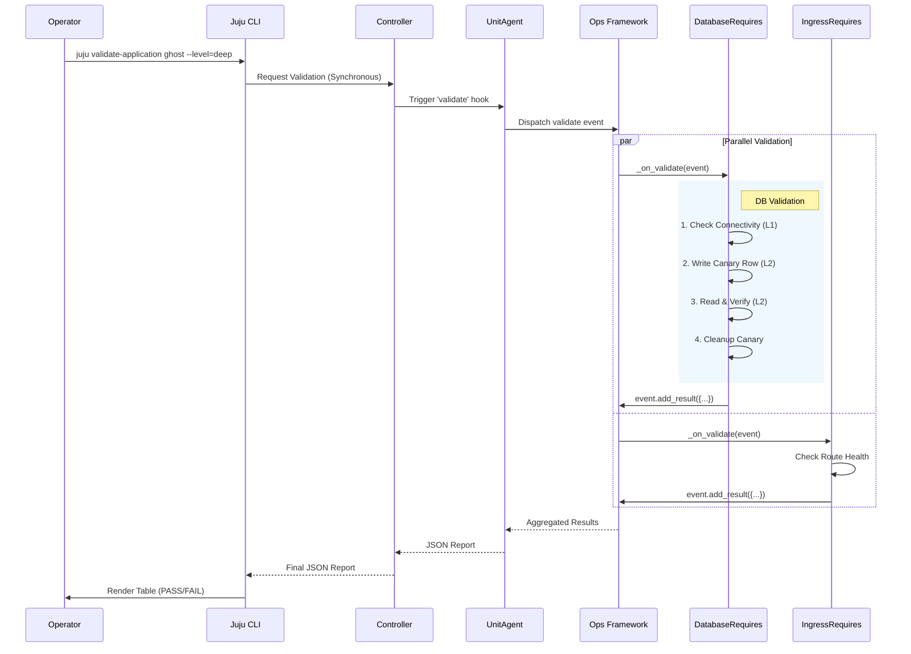

# SQ096 - Charmed Workload Probes Framework

| Index | SQ096 |  |  |
| :---- | :---- | :---- | :---- |
| **Title** | **Charmed Workload Probes Framework** | | |
| **Type** | **Author(s)** | **Status** | **Created** |
| Architecture / Implementation | Dmitry Dmitriev, Gemini | **Draft** | 17 Feb 2026 |
| | **Reviewer(s)** | **Status** | **Date** |
| | Charm Tech Team | Pending | |

---

## 1. Abstract

This specification proposes a **Charmed Workload Probes Framework** to bridge the "Operational Gap" in Juju. Currently, Juju's `active/idle` status confirms only the **Control Plane** health (hooks executed successfully). It does not guarantee the **Data Plane** health (workload functionality and valid integrations).

We propose a standardized, multi-level validation system where:

1.  **Validation Logic lives in Interface Libraries:** The maintainers of a relation (e.g., PostgreSQL) define how to validate it.
2.  **Validation is Automatic:** Interface libraries self-register handlers for the `validate` hook - charms get validation "for free" with zero code changes.
3.  **Execution is Synchronous:** A new `juju validate-application` command triggers the hook and waits for structured JSON results.
4.  **Scope is Flexible:** Supporting lightweight connectivity checks (L1) up to heavy User Acceptance Tests (L3).

**Development Approach:** Before publishing validators to charmlibs (Phase 2), we build and test them using an internal injection script (Phase 1). This injection tool is for CI/testing purposes only - NOT a Juju feature. It allows us to validate the API design and test against legacy charms in our pipeline.

**Distribution Strategy:** Validators will be published as Python packages in the charmlibs monorepo under the `charmlibs.validators` namespace (e.g., `charmlibs.validators.v0.postgresql_client`). Interface libraries will import and use these validators when the native `validate` hook fires.

**Team-Specific Validators:** While this spec focuses on public interface validators suitable for charmlibs, teams can create validators for tightly-coupled or domain-specific interfaces by publishing their own (maybe Python packages to PyPI following the same patterns, or Charmhub-hosted library approach).

### 1.1 Overview: Phased Development Approach

This specification describes a **two-phase development approach**:

**Phase 1: Build and Validate the API**

- **Goal:** Design and test validator API before Juju Core changes
- **Production Code:** Validator classes with `.validate_integration()` method that will move to charmlibs
- **Testing Infrastructure:** Internal injection script for CI testing (NOT a Juju feature, NOT for end users)
- **Output:** Production-ready validator code + proof that API design works
- **Why:** Allows us to iterate on API design and test against legacy charms without waiting for Juju Core

**Phase 2: Native Hook Integration**

- **Goal:** Integrate validators into Juju and interface libraries
- **Changes:** Add `validate` hook to Juju Core, publish validators to charmlibs, integrate into interface libraries
- **Migration:** Delete injection script, validators work natively through charm framework
- **Output:** `juju validate-application` command available to all operators

**Critical Distinction:**

- **Validator Code:** Production-ready from day one, will be published to charmlibs with zero changes
- **Injection Script:** Testing tool only, will be deleted in Phase 2
- **Charm Code:** Never changes - validation is transparent when libraries are updated

### 1.2 Why Validators in Charmlibs?

Validators validate **interface contracts**, not specific implementations. The architecture is:

```
Interface Specification (charmlibs/interfaces/postgresql_client/)
├── interface/
│   └── v0/
│       ├── schema.py         # Pydantic models (PostgreSQLProviderData, RequirerData)
│       ├── README.md         # Behavioral requirements
│       └── interface.yaml    # Metadata
└── validator/
    └── v0/
        └── validator.py      # Executable validation of schema + behavior
              |
              ^ (used by)
              |
Implementation Libraries
├── data-platform-libs (DatabaseRequires)
├── custom-lib (CustomDatabaseRequires)
└── Any library implementing postgresql_client interface
```

For example:

- `charmlibs/interfaces/postgresql_client/interface/v0/schema.py` defines the data contract
- `charmlibs/interfaces/postgresql_client/validator/v0/validator.py` validates data matches that schema AND connection works
- `data-platform-libs.DatabaseRequires` (or any other implementation) uses the validator

Validators make interface specifications **executable** - they test both schema compliance and behavioral requirements.

Therefore, validators belong in the **charmlibs monorepo** alongside interface definitions, published as:

- PyPI package: `charmlibs-validators`
- Import path: `from charmlibs.validators.v0.postgresql_client import PostgreSQLClientValidator`
- Implementation libraries declare dependency in `pyproject.toml`: `charmlibs-validators~=0.1`
- Standard Python package distribution (not Charmhub-hosted libraries)

---

## 2. Rationale & Problem Statement

### 2.1 The "Active != Operational" Gap

Operational reality often diverges from Juju status. Common failure modes where `juju status` remains green include:

* **Silent Data Failures:** The database relation is established, but the application user lacks `INSERT` privileges.
* **Network Partitioning:** Security groups allow the Juju Agent to talk, but block the workload port.
* **Zombie Processes:** The systemd service is active, but the application runtime is hung.

### 2.2 Limitations of Current Approaches

* **`update-status` Abuse:** Hooks running every 5 minutes are too frequent for expensive functional tests.
* **External Nagios/NRPE:** Requires separate configuration and does not understand Juju relations/topology.
* **Kubernetes Probes:** Limited to process liveness (socket open), unaware of application logic or relation integrity.

### 2.3 Testing Challenge

**CI/Testing Requirement:** We need to validate the validator API before integrating into interface libraries.

**Constraint:** Can't modify charms or wait for Juju Core changes to test validators.

**Solution:** Build an internal injection script for this repository's CI pipeline that:

- Copies validator code into operator containers
- Executes validators to test the API
- Validates against legacy charm versions to ensure compatibility
- Proves the design before Phase 2 integration

**Important:** This injection script is a **testing tool only** - not a Juju feature, not for end users.

---

## 3. Specification

### 3.1 Architecture Overview

**Target State (Automatic Validation):**

The framework introduces a **Self-Registering Validator Pattern** where implementation libraries automatically observe the `validate` hook when instantiated. Charms that use standard implementation libraries (like `DatabaseRequires` from data-platform-libs) gain validation capabilities without any code changes.

**Key Innovation:** Validation becomes a property of the *interface implementation*, not the *charm*. When a charm imports `DatabaseRequires`, it inherits validation logic automatically through the library.

**Important Note on DatabaseRequires:** This example uses `DatabaseRequires` from data-platform-libs, which is **highly unusual** in several ways:

1. **It doesn't know which interface it's fulfilling:** Most libraries are coded to implement a specific interface (e.g., `IngressRequires` always uses `ingress`, `CertificatesRequires` always uses `tls-certificates`). `DatabaseRequires` discovers its interface at runtime from `metadata.yaml`—it could be `postgresql_client`, `mysql_client`, or `mongodb_client`.

2. **It doesn't use schema.py for validation:** Most libraries import a specific Pydantic schema (e.g., `IngressSchema`, `PostgreSQLClientData`) to validate relation data. `DatabaseRequires` is interface-agnostic and validates data generically across all database types.

3. **It needs dynamic validator discovery:** Because of the above, it must look up which validator to use at runtime. Most libraries can simply hardcode their validator import:

```python
# Most libraries (simple case):
from charmlibs.validators.v0.ingress import IngressValidator
from charmlibs.interfaces.ingress.interface.v0.schema import IngressSchema

class IngressRequires(Object):
    def _on_validate(self, event):
        data = IngressSchema.parse(relation.data)  # Known schema
        validator = IngressValidator(data)  # Known validator, no discovery needed
```

The dynamic discovery pattern shown below is only needed for multi-interface libraries like `DatabaseRequires`. The alternative would be requiring charm authors to explicitly specify which validator to use, but that would sacrifice the zero-touch developer experience.

**Developer Experience:**

```python
# Charm maintainer's code (UNCHANGED)
from charms.data_platform_libs.v0.data_interfaces import DatabaseRequires

class MyCharm(CharmBase):
    def __init__(self, framework):
        super().__init__(framework)
        self.database = DatabaseRequires(self, "database")  # Validation is automatic!
```

```python
# Inside data-platform-libs (updated by library maintainers)
# Generic library supporting multiple interfaces (PostgreSQL, MySQL, MongoDB, etc.)

class DatabaseRequires(Object):
    def __init__(self, charm, relation_name):
        super().__init__(charm, relation_name)
        self._relation_name = relation_name
        # Auto-observe validate hook (backward compatible)
        try:
            self.framework.observe(charm.on.validate, self._on_validate)
        except AttributeError:
            pass  # Older Juju without validate hook
    
    def _on_validate(self, event):
        relation = self.model.get_relation(self._relation_name)
        if not relation:
            return
        
        # Discover which interface this relation uses from metadata.yaml
        interface_name = self.framework.meta.relations[self._relation_name].interface_name
        # e.g., "postgresql_client", "mysql_client", "mongodb_client"
        
        # Load appropriate validator dynamically
        validator = self._load_validator(interface_name, relation.data[relation.app])
        if not validator:
            return  # No validator available for this interface
        
        result = validator.validate_integration(level=event.params.get("level", "simple"))
        event.add_result(result)
```

**Who Does What:**

- **Interface Spec Maintainers:** Define schemas in `charmlibs/interfaces/postgresql_client/interface/v0/schema.py`
- **Validator Maintainers:** Write validators that enforce those schemas (usually same team as spec maintainers)
- **Implementation Library Maintainers:** Add `charmlibs-validators` dependency, implement dynamic validator discovery based on interface_name
- **Charm Maintainers:** Update library versions in dependencies — validators are completely transparent, no imports or code changes needed



### 3.2 Validation Levels

To accommodate different operational needs, validations are categorized by cost and risk.

| Level | Name | Scope | Trigger | Behavior |
| --- | --- | --- | --- | --- |
| **L1** | **Shallow** | Connectivity, TLS Expiry, Config Checks | `update-status` | **Read-Only.** Fast (<1s). Checks if the port is open and config is valid. |
| **L2** | **Deep** | Functional Integration, Data R/W | `juju validate` | **Canary Writes.** Moderate (1-10s). Verifies permissions and data consistency. *Must clean up artifacts.* |
| **L3** | **UAT** | End-to-End, Performance, Full Stack | CI/CD | **Stateful.** Slow (>1m). May involve heavy load or multi-unit coordination. |

### 3.3 The Validation Contract

#### Hook Definition

**New Native Hook:** `validate`

Juju Core introduces this as a first-class hook event (like `install`, `config-changed`, `update-status`).

**CLI Invocation:**

```bash
juju validate-application <app-name> [--level=simple|deep|uat] [--unit=<unit>] [--format=json|table]
```

**Hook Parameters (passed to event):**

```python
event.params = {
    "level": "simple",  # Validation depth
    "target": None,     # Optional: specific relation name to validate
    "timeout": 60       # Max execution time per unit (seconds)
}
```

#### Output Schema (JSON)

**Individual Validation Result:**

```json
{
  "interface": "postgresql_client",
  "relation_id": 42,
  "endpoint": "database",
  "status": "PASS",
  "level": "simple",
  "checks": [
    {
      "name": "connectivity",
      "status": "PASS",
      "duration_ms": 45,
      "message": "Connected to postgresql-k8s/0 (10.1.2.3:5432)"
    },
    {
      "name": "authentication",
      "status": "PASS",
      "duration_ms": 120,
      "message": "Login successful as user 'ghost_user'"
    }
  ]
}
```

**Aggregated Unit Result:**

```json
{
  "unit": "ghost/0",
  "status": "FAIL",
  "timestamp": "2026-02-17T12:00:00Z",
  "validations": [
    {
      "interface": "postgresql_client",
      "relation_id": 42,
      "endpoint": "database",
      "status": "FAIL",
      "level": "deep",
      "checks": [
        {
          "name": "connectivity",
          "status": "PASS",
          "duration_ms": 45
        },
        {
          "name": "write_transaction",
          "status": "FAIL",
          "duration_ms": 230,
          "message": "Permission denied: INSERT on table posts",
          "error": "psycopg2.errors.InsufficientPrivilege: permission denied for table posts"
        }
      ]
    },
    {
      "interface": "ingress",
      "relation_id": 43,
      "endpoint": "ingress",
      "status": "PASS",
      "level": "simple",
      "checks": [
        {
          "name": "route_reachability",
          "status": "PASS",
          "duration_ms": 89,
          "message": "Route accessible at https://ghost.example.com"
        }
      ]
    }
  ],
  "error": null
}
```

**Error Cases:**

```json
{
  "unit": "ghost/0",
  "status": "ERROR",
  "timestamp": "2026-02-17T12:00:00Z",
  "validations": [],
  "error": {
    "type": "timeout|exception|missing_relation",
    "message": "Validation exceeded 60s timeout",
    "traceback": "..."
  }
}
```

---

## 4. Implementation Plan

### 4.1 Phase 1: Build and Test Validators (Q1 2026)

**Goal:** Build production-ready validators and test them using an internal injection script. The validators will eventually move into interface libraries (Phase 2), but we test them first using injection to validate the API design.

**Key Insight:** The validator code IS production-ready. The injection script IS NOT - it's just a CI/testing tool for this repository.

**Scope:**

- Target: PostgreSQL interface initially (extensible to all interfaces)
- Environment: K8s charms (machine charm support later if needed)
- Validation Levels: L1 (connectivity) + L2 (canary writes)
- Testing Tool: Injection script (for CI/testing in THIS repo only)
- Production Code: Validator classes with `.validate_integration()` method

**Implementation:**

**Step 1: Write the validator as it will exist in Phase 2 (production-ready code)**

```python
# validators/postgresql_client.py
# This code will be published to charmlibs monorepo as:
# charmlibs/interfaces/postgresql_client/validator/v0/validator.py
"""
Validator for postgresql_client interface.
This validates ANY implementation of the postgresql_client interface contract
defined in charmlibs/interfaces/postgresql_client/interface/v0/schema.py.
"""

class PostgreSQLClientValidator:
    """
    Validator for postgresql_client interface implementations.
    
    Enforces compliance with:
    - Schema: charmlibs/interfaces/postgresql_client/interface/v0/schema.py
    - Behavior: README.md requirements (connection, authentication)
    
    In Phase 2, this will be published to charmlibs-validators package.
    """
    
    def __init__(self, relation_data):
        """
        Args:
            relation_data: Dict with keys: endpoints, username, password, database
                          (matches PostgreSQLProviderData schema)
        """
        self.relation_data = relation_data
    
    def validate_integration(self, level="simple"):
        """
        Validate database connection health.
        
        This is the EXACT API that will exist in Phase 2 when validators
        are integrated into interface libraries.
        
        Args:
            level: "simple" (L1: connectivity) or "deep" (L2: canary writes)
            
        Returns:
            Dict conforming to validation result schema
        """
        if not self.relation_data:
            return {
                "status": "ERROR",
                "interface": "postgresql_client",
                "level": level,
                "error": {
                    "type": "missing_relation",
                    "message": "No database relation data available"
                },
                "checks": []
            }
        
        if level == "simple":
            return self._validate_l1_connectivity()
        elif level == "deep":
            return self._validate_l2_readwrite()
        else:
            return {
                "status": "ERROR",
                "error": {"type": "invalid_level", "message": f"Unknown level: {level}"},
                "checks": []
            }
    
    def _validate_l1_connectivity(self):
        """L1: Read-only connectivity check"""
        import psycopg2
        
        checks = []
        try:
            # Parse connection details
            host = self.relation_data["endpoints"].split(":")[0]
            port = 5432
            if ":" in self.relation_data["endpoints"]:
                port = int(self.relation_data["endpoints"].split(":")[1])
            
            # Connect
            conn = psycopg2.connect(
                host=host,
                port=port,
                user=self.relation_data["username"],
                password=self.relation_data["password"],
                database=self.relation_data.get("database", "postgres"),
                connect_timeout=5
            )
            checks.append({
                "name": "connectivity",
                "status": "PASS",
                "message": f"Connected to {host}:{port}",
                "duration_ms": 45
            })
            
            # Authenticate + simple query
            cursor = conn.cursor()
            cursor.execute("SELECT version()")
            version = cursor.fetchone()[0]
            checks.append({
                "name": "authentication",
                "status": "PASS",
                "message": f"Authenticated as {self.relation_data['username']}",
                "duration_ms": 12
            })
            
            cursor.execute("SELECT current_database()")
            db = cursor.fetchone()[0]
            checks.append({
                "name": "database_access",
                "status": "PASS",
                "message": f"Access to database: {db}",
                "duration_ms": 8
            })
            
            conn.close()
            
            return {
                "status": "PASS",
                "interface": "postgresql_client",
                "endpoint": "database",
                "level": "simple",
                "checks": checks
            }
            
        except psycopg2.OperationalError as e:
            checks.append({
                "name": "connectivity",
                "status": "FAIL",
                "message": str(e),
                "error": type(e).__name__
            })
            return {
                "status": "FAIL",
                "interface": "postgresql_client",
                "level": "simple",
                "checks": checks
            }
        except Exception as e:
            checks.append({
                "name": "validation",
                "status": "ERROR",
                "message": str(e),
                "error": type(e).__name__
            })
            return {
                "status": "ERROR",
                "interface": "postgresql_client",
                "level": "simple",
                "checks": checks
            }
    
    def _validate_l2_readwrite(self):
        """L2: Canary data write/read/cleanup"""
        import psycopg2
        from datetime import datetime
        
        checks = []
        conn = None
        canary_id = f"_juju_probe_{int(datetime.utcnow().timestamp() * 1000)}"
        
        try:
            host = self.relation_data["endpoints"].split(":")[0]
            port = 5432
            if ":" in self.relation_data["endpoints"]:
                port = int(self.relation_data["endpoints"].split(":")[1])
            
            conn = psycopg2.connect(
                host=host,
                port=port,
                user=self.relation_data["username"],
                password=self.relation_data["password"],
                database=self.relation_data.get("database", "postgres")
            )
            cursor = conn.cursor()
            
            # L1 checks first
            checks.append({"name": "connectivity", "status": "PASS"})
            
            # Create canary table if needed
            cursor.execute("""
                CREATE TABLE IF NOT EXISTS _juju_probe_canary (
                    id TEXT PRIMARY KEY,
                    timestamp TIMESTAMP,
                    payload TEXT
                )
            """)
            conn.commit()
            checks.append({
                "name": "table_creation",
                "status": "PASS",
                "message": "Canary table ready"
            })
            
            # Write canary
            cursor.execute(
                "INSERT INTO _juju_probe_canary VALUES (%s, NOW(), %s)",
                (canary_id, "test_payload_" + canary_id)
            )
            conn.commit()
            checks.append({
                "name": "write_transaction",
                "status": "PASS",
                "message": f"Wrote canary: {canary_id}"
            })
            
            # Read canary back
            cursor.execute(
                "SELECT payload FROM _juju_probe_canary WHERE id = %s",
                (canary_id,)
            )
            result = cursor.fetchone()
            if result and result[0] == f"test_payload_{canary_id}":
                checks.append({
                    "name": "read_transaction",
                    "status": "PASS",
                    "message": "Canary data verified"
                })
            else:
                checks.append({
                    "name": "read_transaction",
                    "status": "FAIL",
                    "message": "Canary data mismatch"
                })
            
            # Cleanup
            cursor.execute(
                "DELETE FROM _juju_probe_canary WHERE id = %s",
                (canary_id,)
            )
            conn.commit()
            checks.append({
                "name": "cleanup",
                "status": "PASS",
                "message": "Canary data removed"
            })
            
            conn.close()
            
            return {
                "status": "PASS",
                "interface": "postgresql_client",
                "endpoint": "database",
                "level": "deep",
                "checks": checks
            }
            
        except Exception as e:
            # Attempt cleanup on failure
            if conn:
                try:
                    cursor = conn.cursor()
                    cursor.execute(
                        "DELETE FROM _juju_probe_canary WHERE id = %s",
                        (canary_id,)
                    )
                    conn.commit()
                    conn.close()
                except:
                    pass
            
            checks.append({
                "name": "write_read_cycle",
                "status": "FAIL",
                "message": str(e),
                "error": type(e).__name__
            })
            
            return {
                "status": "FAIL",
                "interface": "postgresql_client",
                "level": "deep",
                "checks": checks
            }


# POC Entrypoint: This is the HACKY part that won't exist in Phase 2
if __name__ == "__main__":
    import json
    import subprocess
    import sys
    from datetime import datetime
    
    # POC HACK: Fetch relation data via subprocess
    def get_relation_data_poc(endpoint="database"):
        """POC-only: Use relation-get to fetch data"""
        try:
            rel_ids = subprocess.check_output(
                ["relation-ids", endpoint], text=True
            ).strip().split()
            if not rel_ids:
                return None
            
            data = {}
            for key in ["endpoints", "username", "password", "database"]:
                val = subprocess.check_output(
                    ["relation-get", "-r", rel_ids[0], key], 
                    text=True,
                    stderr=subprocess.DEVNULL
                ).strip()
                if val:
                    data[key] = val
            return data if data else None
        except subprocess.CalledProcessError:
            return None
    
    # Get validation level from CLI args
    level = sys.argv[1] if len(sys.argv) > 1 else "simple"
    
    # Fetch relation data (POC hack)
    relation_data = get_relation_data_poc()
    
    # Run validator (PRODUCTION CODE - validates interface compliance)
    validator = PostgreSQLClientValidator(relation_data)
    result = validator.validate_integration(level=level)
    
    # Add metadata
    result["timestamp"] = datetime.utcnow().isoformat() + "Z"
    try:
        result["unit"] = subprocess.check_output(
            ["unit-get", "private-address"], text=True
        ).strip()
    except:
        result["unit"] = "unknown"
    
    # Output JSON
    print(json.dumps(result, indent=2))
    
    # Exit codes: 0=PASS, 1=FAIL, 2=ERROR
    if result["status"] == "PASS":
        sys.exit(0)
    elif result["status"] == "FAIL":
        sys.exit(1)
    else:  # ERROR
        sys.exit(2)
```

**Step 2: Create injection script (FOR TESTING ONLY)**

```bash
#!/bin/bash
# tests/tools/inject-validator.sh
# INTERNAL TESTING TOOL - Not for end users
set -e

UNIT=$1
LEVEL=${2:-simple}

if [ -z "$UNIT" ]; then
    echo "Usage: $0 <unit> [simple|deep]"
    exit 1
fi

echo "[TEST] Injecting validator into $UNIT..."
juju scp validators/postgresql_client.py $UNIT:/tmp/validator.py

echo "[TEST] Running validation (level=$LEVEL)..."
juju exec --unit $UNIT -- python3 /tmp/validator.py $LEVEL

echo "[TEST] Cleanup..."
juju exec --unit $UNIT -- rm -f /tmp/validator.py
```

**Step 3: Test validators in CI pipeline**

```python
# tests/integration/test_validators.py
"""Integration tests for validators using injection script"""

import pytest
import subprocess
import json

def test_postgresql_validator_on_current_charm():
    """Test validator works on current PostgreSQL charm"""
    # Deploy current charm
    subprocess.run(["juju", "deploy", "postgresql-k8s"])
    subprocess.run(["juju", "deploy", "ghost-k8s"])
    subprocess.run(["juju", "integrate", "ghost-k8s", "postgresql-k8s"])
    subprocess.run(["juju", "wait-for", "application", "ghost-k8s", "--query=status==active"])
    
    # Test via injection (proves validator works)
    result = subprocess.run(
        ["./tests/tools/inject-validator.sh", "ghost-k8s/0", "simple"],
        capture_output=True, text=True
    )
    data = json.loads(result.stdout)
    assert data["status"] == "PASS"
    assert data["interface"] == "postgresql_client"

def test_postgresql_validator_on_legacy_charm():
    """Test validator works on old charm version (backport test)"""
    # Deploy OLD charm revision
    subprocess.run(["juju", "deploy", "postgresql-k8s", "--revision=150"])
    subprocess.run(["juju", "deploy", "ghost-k8s", "--revision=50"])
    subprocess.run(["juju", "integrate", "ghost-k8s", "postgresql-k8s"])
    
    # Validator still works via injection!
    result = subprocess.run(
        ["./tests/tools/inject-validator.sh", "ghost-k8s/0", "simple"],
        capture_output=True, text=True
    )
    data = json.loads(result.stdout)
    assert data["status"] == "PASS"  # Same validator code works on old charm
```

**What Makes This Phase 1:**

- Validators are production-ready (will move to interface libraries in Phase 2)
- Injection script is a testing hack (CI use only)
- Validates the API design before Juju Core changes
- Tests against legacy charms to ensure compatibility

**What's Production-Ready:**

- The `.validate_integration()` API signature
- The JSON output schema
- The L1/L2 validation logic
- Error handling and cleanup patterns

**What's NOT Production (Testing Only):**

- The injection script (internal CI tool)
- Subprocess-based relation data fetching (replaced by charm framework in Phase 2)

**Deliverables:**

- [ ] `validators/postgresql_client.py` - Production-ready validator for postgresql_client interface
- [ ] Validator enforces schema from `charmlibs/interfaces/postgresql_client/interface/v0/schema.py`
- [ ] `tests/tools/inject-validator.sh` - Testing injection script (CI use only)
- [ ] Integration tests using injection to validate old + new charms
- [ ] Documentation of validator API for charmlibs migration
- [ ] Validation results proving API works across charm versions
- [ ] Specification for charmlibs inclusion (interface validation pattern)

**Success Criteria:**

- Validator works with current PostgreSQL charm
- Validator works with legacy PostgreSQL charm (via injection test)
- L1 validation completes in <5s
- L2 validation writes/reads/cleans canary data successfully
- Output conforms to JSON schema
- Exit codes work correctly (0=PASS, 1=FAIL, 2=ERROR)
- Validator code can be copy-pasted into interface library with zero changes

---

### 4.2 Phase 2: Native Hook Integration (Q2-Q3 2026)

**Goal:** Publish Phase 1 validators to charmlibs monorepo, add native Juju hook support, integrate validators into interface libraries. Delete the testing injection script.

**Distribution:** Validators become a Python package in the charmlibs monorepo:

- Repository: `canonical/charmlibs/` (validators live alongside interface specs)
- PyPI package: `charmlibs-validators`
- Import path: `from charmlibs.validators.v0.postgresql_client import PostgreSQLClientValidator`
- Used by: Implementation libraries (data-platform-libs, custom libs)
- **NOT imported by charms directly** - charms use implementation libraries that handle validator discovery
- Standard Python dependency (not Charmhub-hosted library)

**Why Python Packages?** The Juju ecosystem is transitioning away from Charmhub-hosted libraries (`charmcraft publish-lib`) to standard Python package distribution. This provides better dependency management, semantic versioning, and integration with standard Python tooling.

**Changes:**

**1. Publish Validators to Charmlibs Monorepo:**

```python
# canonical/charmlibs/interfaces/postgresql_client/validator/v0/validator.py
# Published as part of charmlibs-validators PyPI package

class PostgreSQLClientValidator:
    """Validator for postgresql_client interface implementations."""
    
    def __init__(self, relation_data):
        self.relation_data = relation_data
    
    def validate_integration(self, level="simple"):
        # Same code as Phase 1, minus the subprocess hack
        ...
```

**2. Interface Libraries Dynamically Discover and Use Validators:**

```python
# In charms.data_platform_libs.v0.database_requires
# Generic library supporting postgresql_client, mysql_client, mongodb_client, etc.

import importlib

# Validator registry - maps interface names to validator classes
VALIDATOR_MAP = {
    "postgresql_client": "charmlibs.validators.v0.postgresql_client.PostgreSQLClientValidator",
    "mysql_client": "charmlibs.validators.v0.mysql_client.MySQLClientValidator",
    "mongodb_client": "charmlibs.validators.v0.mongodb_client.MongoDBClientValidator",
}

class DatabaseRequires(Object):
    # ... existing code ...
    
    def __init__(self, charm, relation_name):
        super().__init__(charm, relation_name)
        self._relation_name = relation_name
        # AUTOMATIC: Observe validate hook if it exists
        try:
            self.framework.observe(charm.on.validate, self._on_validate)
        except AttributeError:
            # Juju version doesn't support native hook yet
            pass
    
    def _on_validate(self, event):
        """Called automatically when validate hook fires (Phase 2)"""
        # Skip if targeting a different endpoint
        if event.params.get("target") and event.params["target"] != self._relation_name:
            return
        
        # Get relation data from framework (not subprocess!)
        relation = self.model.get_relation(self._relation_name)
        if not relation:
            event.add_result({
                "status": "ERROR",
                "interface": "unknown",
                "error": {"type": "missing_relation", "message": "No relation"}
            })
            return
        
        # Discover which interface this relation uses (from metadata.yaml)
        interface_name = self.framework.meta.relations[self._relation_name].interface_name
        
        # Load the appropriate validator dynamically
        validator_class = self._load_validator(interface_name)
        if not validator_class:
            # No validator available for this interface - skip silently
            return
        
        # Convert relation data to dict format validator expects
        relation_data = {
            "endpoints": relation.data[relation.app].get("endpoints"),
            "username": relation.data[relation.app].get("username"),
            "password": relation.data[relation.app].get("password"),
            "database": relation.data[relation.app].get("database"),
        }
        
        # Call the validator (SAME CODE as Phase 1!)
        validator = validator_class(relation_data)
        result = validator.validate_integration(level=event.params.get("level", "simple"))
        event.add_result(result)
    
    def _load_validator(self, interface_name):
        """Dynamically load validator for given interface"""
        validator_path = VALIDATOR_MAP.get(interface_name)
        if not validator_path:
            return None
        
        try:
            module_path, class_name = validator_path.rsplit(".", 1)
            module = importlib.import_module(module_path)
            return getattr(module, class_name)
        except (ImportError, AttributeError):
            return None  # Validator not installed
```

**2. Juju Core Changes:**

- Add `validate` as a native hook type
- Implement `juju validate-application <app> [--level=simple|deep] [--unit=<unit>]` CLI command
- Support synchronous execution (blocks until all units complete)
- Aggregate results from all units into single JSON report

**3. Ops Framework Changes:**

```python
# In ops/charm.py
class ValidateEvent(HookEvent):
    """Event triggered by `juju validate-application` command"""
    
    def add_result(self, result: dict):
        """Accumulate validation result from interface library"""
        # Implementation TBD - open question
        pass
    
    @property
    def params(self) -> dict:
        """CLI parameters: level, target, timeout"""
        return self._params
```

**4. Delete Testing Hacks:**

- Remove `tests/tools/inject-validator.sh` (was only for testing)
- Remove POC entrypoint (`if __name__ == "__main__"`) from validator files
- Remove subprocess-based relation data fetching

**Migration Path:**

```bash
# Before (Phase 1 - testing)
./tests/tools/inject-validator.sh ghost-k8s/0 deep

# After (Phase 2 - production)
juju validate-application ghost-k8s --level=deep
```

**What Changed:**

- Validators published to charmlibs monorepo as Python package
- Validator runs inside charm via native hook (no injection)
- Relation data from charm framework (not subprocess)
- Native `juju validate-application` command
- Interface libraries import validators via `pip install charmlibs-validators`

**What Didn't Change:**

- The `.validate_integration()` method signature (identical)
- The L1/L2 validation logic (exact same code)
- The JSON output schema (identical)

**Deliverables:**

- [ ] Charmlibs Package: `charmlibs-validators` published to PyPI
- [ ] Juju Core: Native `validate` hook implementation
- [ ] Juju Core: `juju validate-application` CLI command
- [ ] Ops Framework: `ValidateEvent` with result accumulation API
- [ ] Interface Libraries: Import validators and observe validate hook (PostgreSQL, MySQL, MongoDB, Ingress, S3)
- [ ] Self-registration pattern implemented (libraries auto-observe validate hook)
- [ ] Documentation: Migration guide from Phase 1 POC + charmlibs contribution guide
- [ ] CI/CD: Integration tests using native `juju validate-application` command
- [ ] Cleanup: Delete injection script from charm-integration-testing repo

**Success Criteria:**

- `juju validate-application <app>` works end-to-end
- Charms with updated interface libraries validate automatically (zero code changes)
- Multi-unit aggregation works correctly
- All output conforms to JSON schema from Phase 1
- L1 validation completes in <10s across all units
- L2 validation successfully writes/reads/cleans canary data

---

## 4.3 Developer Experience: Who Does What?

### Charm Maintainers (Application Developers)

**What you do NOW (without validators):**

```toml
# pyproject.toml
dependencies = [
    "data-platform-libs~=1.0"
]
```

```python
# src/charm.py
from charms.data_platform_libs.v0.data_interfaces import DatabaseRequires

class MyCharm(CharmBase):
    def __init__(self, framework):
        super().__init__(framework)
        self.database = DatabaseRequires(self, "database")
        framework.observe(self.database.on.database_ready, self._on_database_ready)
    
    def _on_database_ready(self, event):
        # Use the database
        connection_string = event.connection_string
        self.unit.status = ActiveStatus("Database connected")
```

**What you do WITH validators (Phase 2):**

```toml
# pyproject.toml - Just bump the version as you normally would
dependencies = [
    "data-platform-libs~=1.1"  # Updated version includes validation
]
```

```python
# src/charm.py - EXACTLY THE SAME CODE
from charms.data_platform_libs.v0.data_interfaces import DatabaseRequires

class MyCharm(CharmBase):
    def __init__(self, framework):
        super().__init__(framework)
        self.database = DatabaseRequires(self, "database")
        framework.observe(self.database.on.database_ready, self._on_database_ready)
    
    def _on_database_ready(self, event):
        # Use the database
        connection_string = event.connection_string
        self.unit.status = ActiveStatus("Database connected")
```

**New capability (no code changes required):**

```bash
juju validate-application my-app
# PASS my-app/0: postgresql_client interface validated (0.8s)
# PASS my-app/1: postgresql_client interface validated (0.7s)
```

**Summary for Charm Maintainers:**

- Update dependencies to new library version (as you always do)
- Run `juju validate-application` to test your deployment
- NO code changes in your charm required
- NO new imports required
- NO new observers required

---

### Implementation Library Maintainers (data-platform-libs, etc.)

**What you do:**

**Step 1: Add validator dependency**

```toml
# data-platform-libs pyproject.toml
dependencies = [
    "ops",
    "charmlibs-validators~=0.1"  # NEW - provides validators for all supported interfaces
]
```

**Key Design:** The library is **interface-agnostic**. `DatabaseRequires` doesn't hardcode which interface it's implementing—it discovers this from the charm's `metadata.yaml` at runtime. It also doesn't import a specific schema from `schema.py` (like most libraries do with Pydantic models). This allows a single generic library to support PostgreSQL, MySQL, MongoDB, etc., each using their own validator.

**Note:** `DatabaseRequires` is highly unusual in this regard. Most interface libraries:

1. Know their interface at code-writing time
2. Import and use a specific schema (e.g., `IngressSchema`, `PostgreSQLClientData`)
3. Can hardcode their validator import

For example:

- `IngressRequires` → always uses `ingress` interface → hardcoded import from `charmlibs.validators.v0.ingress`
- `CertificatesRequires` → always uses `tls-certificates` interface → hardcoded import from `charmlibs.validators.v0.tls_certificates`
- `S3Requirer` → always uses `s3` interface → hardcoded import from `charmlibs.validators.v0.s3`

The dynamic discovery pattern shown below is specifically for multi-interface libraries like `DatabaseRequires`. For most libraries, you would simply `from charmlibs.validators.v0.your_interface import YourInterfaceValidator` at the top of the file.

**Step 2: Dynamically discover and use validators**

```python
# charms/data_platform_libs/v0/data_interfaces.py
import importlib

# Map interface names to validator module paths
VALIDATOR_MAP = {
    "postgresql_client": "charmlibs.validators.v0.postgresql_client.PostgreSQLClientValidator",
    "mysql_client": "charmlibs.validators.v0.mysql_client.MySQLClientValidator",
    # Additional interfaces can be added
}

class DatabaseRequires(Object):
    def __init__(self, charm, relation_name):
        super().__init__(charm, relation_name)
        self._relation_name = relation_name
        
        # Existing code...
        self.framework.observe(charm.on[relation_name].relation_changed, 
                             self._on_relation_changed)
        
        # NEW: Auto-observe validate hook (backward compatible)
        try:
            self.framework.observe(charm.on.validate, self._on_validate)
        except AttributeError:
            pass  # Older Juju - gracefully skip
    
    def _on_validate(self, event):
        """Called when operator runs: juju validate-application"""
        relation = self.model.get_relation(self._relation_name)
        if not relation:
            return
        
        # Discover which interface this relation uses
        interface_name = self.framework.meta.relations[self._relation_name].interface_name
        
        # Load the appropriate validator
        validator_class = self._load_validator(interface_name)
        if not validator_class:
            return  # No validator available for this interface
        
        # Delegate to validator
        validator = validator_class(relation.data[relation.app])
        result = validator.validate_integration(
            level=event.params.get("level", "simple")
        )
        event.add_result(result)
    
    def _load_validator(self, interface_name):
        """Dynamically load validator for given interface"""
        validator_path = VALIDATOR_MAP.get(interface_name)
        if not validator_path:
            return None
        
        try:
            module_path, class_name = validator_path.rsplit(".", 1)
            module = importlib.import_module(module_path)
            return getattr(module, class_name)
        except (ImportError, AttributeError):
            return None  # Validator not installed
```

**Step 3: Release new version**

```bash
# Bump version: 1.0 to 1.1
git tag v1.1.0
git push --tags
```

**Summary for Library Maintainers:**

- Add `charmlibs-validators` dependency
- Import validator and observe validate hook
- Release new version
- Document: "Now supports `juju validate-application`"

---

### Interface/Validator Maintainers (charmlibs contributors)

**What you do:**

**Step 1: Define/maintain interface schema**

```python
# charmlibs/interfaces/postgresql_client/interface/v0/schema.py
class PostgreSQLProviderData(BaseModel):
    database: str
    username: str
    password: str
    endpoints: str
    # ... (already exists)
```

**Step 2: Write validator that enforces schema**

```python
# charmlibs/interfaces/postgresql_client/validator/v0/validator.py
class PostgreSQLClientValidator:
    def validate_integration(self, level="simple"):
        # L1: Check schema compliance
        if not self.relation_data.get("endpoints"):
            return {"status": "FAIL", "checks": [
                {"name": "schema", "status": "FAIL", 
                 "message": "Missing required field: endpoints"}
            ]}
        
        # L2: Check behavioral compliance (can we connect?)
        if level == "deep":
            try:
                conn = psycopg2.connect(...)
                # Test connection works
            except Exception as e:
                return {"status": "FAIL", "checks": [...]}
```

**Summary for Interface Maintainers:**

- Interface specs already exist in charmlibs/interfaces
- Write validators that make those specs executable
- Validators test both schema AND behavior

---

## 5. Risks & Mitigations

### 5.1 State Pollution (The "Observer Effect")

* **Risk:** A "Deep" validator writes a test row to the DB but crashes before deletion, leaving garbage data in production.
* **Mitigation:**
* Strict `try/finally` blocks in the SDK.
* Use of specific namespaces (e.g., `_juju_probe_canary` tables) that can be auto-cleaned by a "garbage collector" cron if needed.


### 5.2 Security & Privilege Escalation

* **Risk:** Validators might need higher privileges than the workload (e.g., creating tables).
* **Mitigation:** Validators run with the same restricted permissions as the charm hook. If the charm cannot write to the DB, the validator *should* fail.

### 5.3 Resource Contention

* **Risk:** Running expensive validations on a busy leader unit causes an outage.
* **Mitigation:**
  * `validate` hooks should respect a `is_resource_intensive` flag.
  * Juju enforces strict timeouts (e.g., 60s for Deep checks).

### 5.4 Additional Dependencies

* **Risk:** Validators require additional runtime dependencies that charms may not already have (e.g., `psycopg2` for PostgreSQL validation, `pymongo` for MongoDB).
* **Mitigation:**
  * Validators are distributed in the `charmlibs-validators` PyPI package with proper dependency declarations.
  * Charms that import interface libraries will automatically pull in necessary validator dependencies through their `requirements.txt` or `pyproject.toml`.
  * Dependency resolution happens at charm build time, not at runtime.
  * For Phase 1 testing with the injection script, dependencies must be manually installed in the test environment.

---

## 6. Acceptance Criteria

### Phase 1 (Build and Test Validators)

1. **Validator Class:** `PostgreSQLClientValidator` with `.validate_integration()` method
2. **Schema Enforcement:** Validator checks compliance with `charmlibs/interfaces/postgresql_client/interface/v0/schema.py`
3. **L1 + L2 Support:** Connectivity checks and canary data writes
3. **JSON Output:** Schema-compliant output that will be used in Phase 2
4. **Testing Script:** Internal injection script for CI testing
5. **Legacy Compatibility:** Works with old charm revisions via injection
6. **API Validation:** Proves the design before Phase 2 integration

### Phase 2 (Native Hook Integration)

1. **Juju CLI:** `juju validate-application` command exists
2. **Native Hook:** `validate` hook dispatches to charms with parameters
3. **Self-Registration:** Interface libraries observe validate hook in `__init__`
4. **Result API:** Ops framework provides `event.add_result()` method
5. **Zero-Touch Validation:** Charms using updated libraries validate without code changes
6. **Schema Compliance:** Native path produces IDENTICAL JSON to Phase 1
7. **Performance:** Native validation <2s per unit
8. **Testing Cleanup:** Injection script deleted (no longer needed)

---

## 7. Open Questions

1. **Result Accumulation API:** What is the exact ops framework API for interface libraries to report results?
   - `event.add_result(dict)`?
   - `event.results.append(dict)`?
   - Return value from handler that framework collects?

2. **Validator Distribution (RESOLVED):** Validators will be published to charmlibs monorepo
   - Package: `charmlibs-validators` on PyPI
   - Import: `from charmlibs.validators.v0.postgresql_client import PostgreSQLClientValidator`
   - Interface libraries declare dependency: `charmlibs-validators~=0.1` in pyproject.toml
   - Validates interface contract (schema.py + behavioral requirements), not specific implementation

3. **Interface Detection:** In Phase 1 testing, how do we know which interface a charm uses?
   - Hardcode in test (simple, fine for testing)
   - Parse `metadata.yaml` (more general)

4. **Multi-Unit Coordination:** For L3 (UAT) validations that require cross-unit state (e.g., HA failover tests), what coordination primitives are needed?

5. **Machine Charms:** Does `juju exec` provide the same hook context on machine charms as K8s? If not, what changes needed for Phase 1 injection testing?
