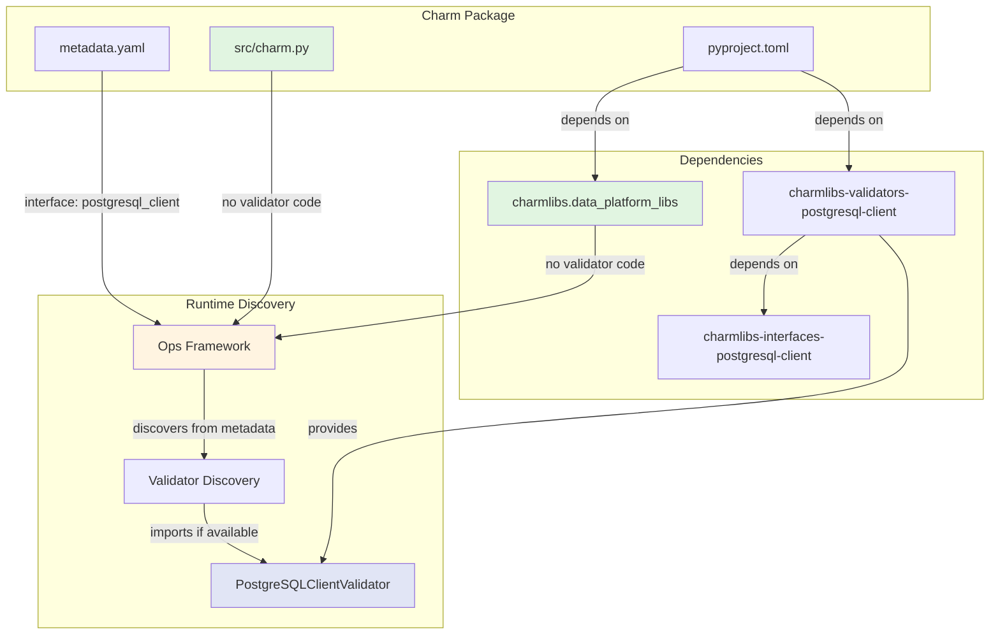
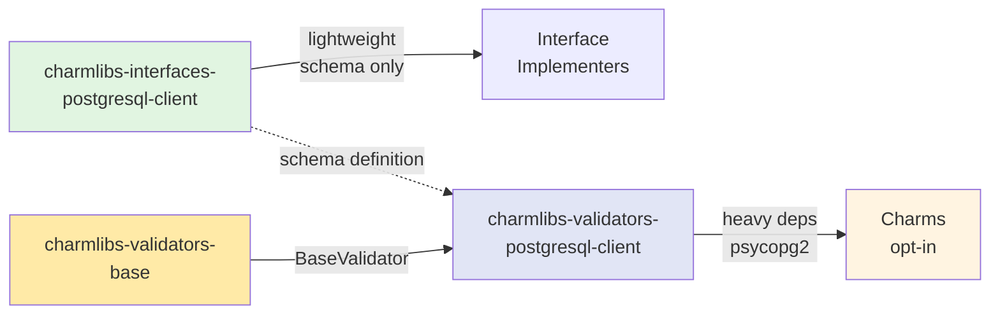
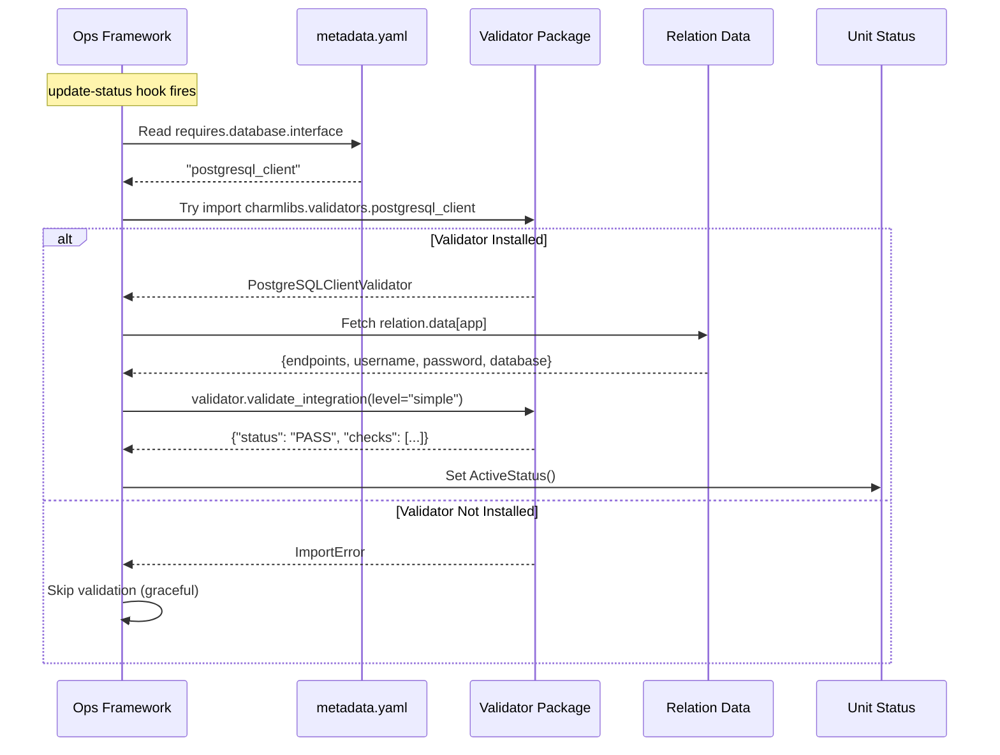
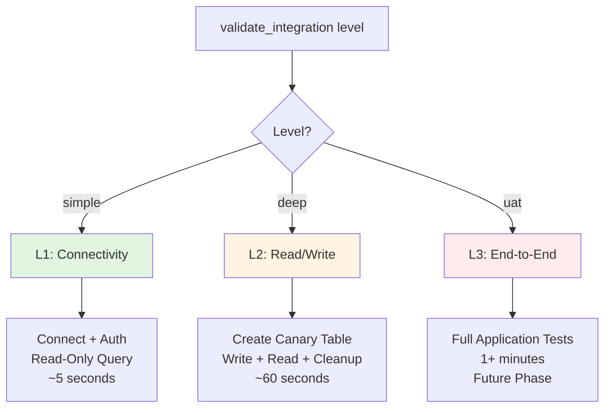
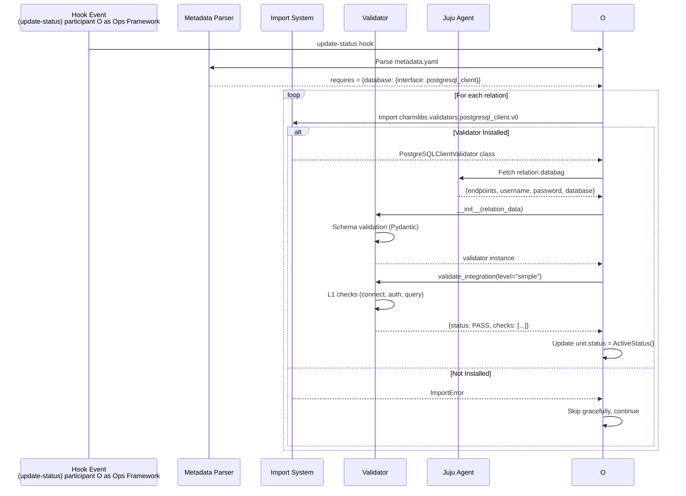
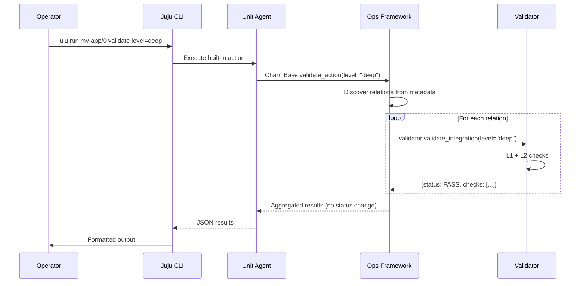
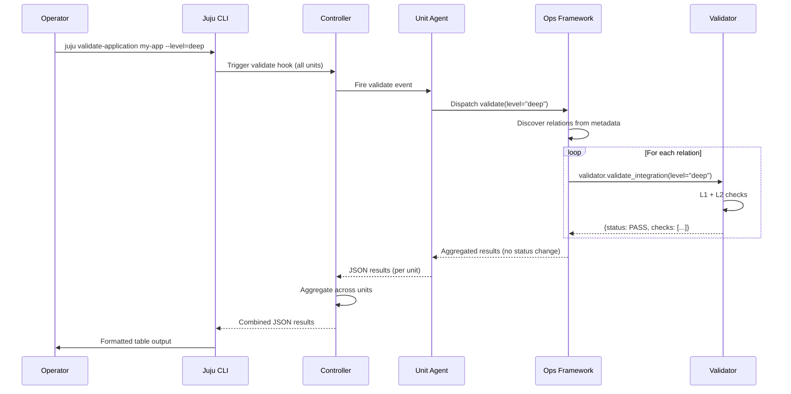
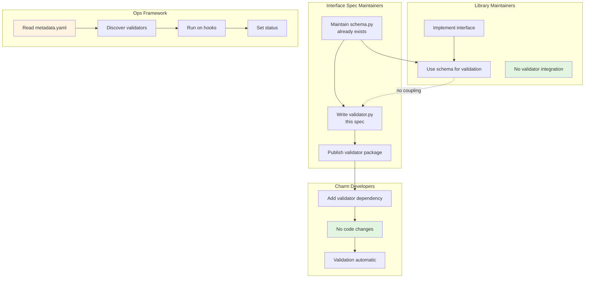

# SQ096 - Interface Validators Framework

| Index | SQ096 |  |  |
| :---- | :---- | :---- | :---- |
| **Title** | **Interface Validators Framework** | | |
| **Type** | **Author(s)** | **Status** | **Created** |
| Architecture / Implementation | Ryan Barry, Claude Sonnet 4.5 | **Draft** | 18 Feb 2026 |
| | **Reviewer(s)** | **Status** | **Date** |
| | Charm Tech Team | Pending | |

---

## 1. Abstract

This specification proposes an **Interface Validators Framework** enabling automatic integration health checks for Juju charms. Validators are **interface-specific**, **implementation-agnostic**, and **framework-driven**.

Validators build on **existing interface schema packages** (e.g., `charmlibs-interfaces-postgresql-client`) that are already published and maintained by interface specification owners. This specification defines how to add executable validation to those existing interface definitions.

### 1.1 Key Innovation: Framework-Driven Validation

**This specification introduces framework-driven validation**: The Ops framework itself discovers and runs validators based on `metadata.yaml` interface declarations. Implementation libraries remain completely unaware of validators.

**Why Framework-Driven?**

The alternative is requiring every charm maintainer to implement validation separately:

```python
# Without framework-driven validation - every charm needs this boilerplate:
class MyCharm(CharmBase):
    def _on_validate(self, event):
        # Discover interfaces from metadata
        # Import correct validator for each interface
        # Fetch relation databags
        # Run validators
        # Aggregate results
        # Set status appropriately
        # 50+ lines of repetitive code
```

This creates massive duplication:

- 1000+ charms each implementing the same discovery logic
- Inconsistent validation behavior across ecosystem
- High barrier to adoption (requires expertise)
- Easy to get wrong (error handling, status management)

**With framework-driven validation, charms get it for free:**

```python
# With framework-driven validation - charm maintainer writes zero code:
class MyCharm(CharmBase):
    def __init__(self, framework):
        super().__init__(framework)
        # That's it. Validation is automatic and magical.
```

**Key benefits:**

- Validators work with ANY implementation library
- Validators work even without a library (direct relation data access)
- Zero coupling between libraries and validators
- Consistent validation across the entire ecosystem
- Near-100% adoption (adding a dependency vs writing code)
- Single point of maintenance (framework, not 1000+ charms)



### 1.2 Package Architecture

Validators build on **existing interface schema packages** that are already published and maintained by interface spec owners. By distributing validators separately, we enable opt-in validation without forcing heavy test dependencies on interface implementers.

**Schema Package (Already Exists - Lightweight):**

```
charmlibs-interfaces-postgresql-client
└── charmlibs/interfaces/postgresql_client/v0/
    └── schema.py  # PostgreSQLProviderData (already published)
```

**Validator Package (This Specification - With Test Dependencies):**

```
charmlibs-validators-postgresql-client
├── depends on: charmlibs-interfaces-postgresql-client (existing)
├── depends on: charmlibs-validators-base (base class)
├── depends on: psycopg2-binary (test dependencies)
└── charmlibs/validators/postgresql_client/v0/
    └── validator.py  # PostgreSQLClientValidator (new)
```

**Validator Base Package (Shared Infrastructure):**

```
charmlibs-validators-base
└── charmlibs/validators/
    └── base.py  # BaseValidator, TypedDict definitions
```



### 1.3 Developer Experience

**Charm Code (Zero Changes Required):**

```python
from ops import CharmBase, main
from charms.data_platform_libs.v0.data_interfaces import DatabaseRequires

class MyCharm(CharmBase):
    def __init__(self, framework):
        super().__init__(framework)
        self.database = DatabaseRequires(self, "database")
        # Validation happens automatically! No code here.
```

**Charm Dependencies (Opt-In):**

```toml
# pyproject.toml
dependencies = [
    "ops>=2.0",
    "charmlibs.data_platform_libs>=1.0",
    "charmlibs-validators-postgresql-client>=1.0",  # Add this for validation
]
```

The Ops framework automatically:

1. Reads `metadata.yaml` to discover `interface: postgresql_client`
2. Attempts to import `charmlibs.validators.postgresql_client.v0.validator`
3. If found, runs validation automatically on hooks (see Hook Integration)
4. Sets unit status based on validation results
5. If not found, gracefully skips validation

**Operator Experience (On-Demand Validation):**

Two implementation options (see Section 4.2.1 for details):

```bash
# Option A: Built-in action (simpler, no Juju Core changes)
$ juju run my-app/0 validate level=deep

# Option B: Dedicated hook (more powerful, requires Juju Core changes)
$ juju validate-application my-app --level=deep

# Both return structured results
```

**Example Output:**

```
Validating my-app/0...

Relation: database-primary (postgresql_client)
  Status: PASS
  Level: deep
  Duration: 1.2s
  Checks:
    - connectivity: PASS (234ms)
    - authentication: PASS (156ms)
    - canary_write: PASS (423ms)
    - canary_read: PASS (201ms)
    - cleanup: PASS (186ms)

Relation: database-replica (postgresql_client)
  Status: PASS
  Level: deep
  Duration: 1.0s
  Checks:
    - connectivity: PASS (189ms)
    - authentication: PASS (145ms)
    - canary_write: PASS (390ms)
    - canary_read: PASS (178ms)
    - cleanup: PASS (120ms)

Overall: PASS
```

---

## 2. Rationale & Problem Statement

### 2.1 The Challenge: Generic Implementation Libraries

DatabaseRequires is a **generic, interface-agnostic** library that discovers its interface at runtime:

```python
# metadata.yaml
requires:
  database:
    interface: postgresql_client  # Could be mysql_client, mongodb_client, etc.
```

```python
# DatabaseRequires doesn't know which interface until runtime
class DatabaseRequires:
    def _on_validate(self, event):
        # Which validator to import? postgresql? mysql? mongodb?
        interface_name = self._discover_interface_from_metadata()
        validator = self._dynamic_import(f"charmlibs.validators.{interface_name}")
```

This creates challenges:

- How can a generic library know which validator to use?
- What about custom implementations that don't use standard libraries?
- What about charms using **no library** (direct relation access)?

```python
class MyCharm(CharmBase):
    def _on_database_relation_changed(self, event):
        # Accessing relation data directly, no DatabaseRequires
        db_data = event.relation.data[event.app]
        # How does validation happen here?
```

### 2.2 The Critical Need: Avoid Per-Charm Duplication

**Without framework-driven validation**, every charm maintainer must:

1. Parse `metadata.yaml` to discover interfaces
2. Dynamically import validators for each interface
3. Fetch relation databags from Juju
4. Execute validators with proper error handling
5. Aggregate results across multiple relations
6. Set unit status appropriately
7. Handle failures, retries, timeouts
8. Implement both automatic and on-demand validation

This is 50-100 lines of complex boilerplate code that must be:

- Duplicated across 1000+ charms in the ecosystem
- Maintained separately by each charm team
- Tested independently in each charm
- Kept consistent across the ecosystem

**Result:** Low adoption (high barrier), inconsistent behavior, maintenance burden.

### 2.3 The Solution: Framework-Driven Discovery

**Key Insight:** Validators validate **interface contracts**, not **library implementations**.

The interface is declared in `metadata.yaml`, which the framework already reads:

```yaml
requires:
  database:
    interface: postgresql_client
```

**Solution:** The Ops framework discovers validators **by convention** based on interface declarations:

```python
# Inside Ops framework (CharmBase or extension)
for relation_name, relation_config in metadata.requires.items():
    interface_name = relation_config.interface
    
    try:
        validator_module = f"charmlibs.validators.{interface_name}.v0.validator"
        validator_class = f"{interface_to_class_name(interface_name)}Validator"
        
        ValidatorClass = import_module(validator_module).getattr(validator_class)
        # Run validation...
    except ImportError:
        # Validator not installed, skip gracefully
        pass
```

**Benefits:**

- Works with ANY implementation library
- Works with NO implementation library
- Zero library code changes
- Zero charm code changes
- Single source of truth: metadata.yaml
- Consistent validation across ecosystem



---

## 3. Specification

### 3.1 Package Structure

#### 3.1.1 Schema Package (Existing Infrastructure)

**Note:** Interface schema packages already exist and are maintained by interface specification owners. Validators leverage these existing schemas.

**Package Name:** `charmlibs-interfaces-postgresql-client` (already published)

**Import Path:** `from charmlibs.interfaces.postgresql_client.v0 import schema`

**Example Contents:**

```python
# charmlibs/interfaces/postgresql_client/v0/schema.py (already exists)
from pydantic import BaseModel

class PostgreSQLProviderData(BaseModel):
    endpoints: str
    username: str
    password: str
    database: str
```

**Dependencies:** `pydantic` only (lightweight)

**Current Consumers:**

- Interface implementation libraries
- Charms that validate relation data

**New Consumer (This Spec):**

- Validators (import schema for validation)

#### 3.1.2 Validator Base Package (This Specification - Phase 1)

**Package Name:** `charmlibs-validators-base` (new, shared by all validators)

**Import Path:** `from charmlibs.validators.base import BaseValidator`

**Purpose:** Provides base class and type definitions for all interface validators.

**Timeline:** Built in Phase 1, published to PyPI in Phase 2 (no code changes).

**Contents:**

- `BaseValidator` abstract class
- `ValidationResult`, `ValidationCheck`, `ValidationError` TypedDict definitions
- Helper methods for result formatting
- Consistent API enforcement

**Dependencies:** Python 3.8+, `typing-extensions` (for Python 3.8 compatibility)

#### 3.1.3 Validator Package (This Specification - Phase 1)

**Package Name:** `charmlibs-validators-postgresql-client` (new)

**Import Path:** `from charmlibs.validators.postgresql_client.v0.validator import PostgreSQLClientValidator`

**Timeline:** Built in Phase 1, published to PyPI in Phase 2 (no code changes).

**Contents:**

```python
# charmlibs/validators/postgresql_client/v0/validator.py
from charmlibs.interfaces.postgresql_client.v0 import schema
from charmlibs.validators.base import BaseValidator
import psycopg2

class PostgreSQLClientValidator(BaseValidator):
    interface_name = "postgresql_client"
    
    def _validate_schema(self, relation_data: dict):
        return schema.PostgreSQLProviderData.parse_obj(relation_data)
    
    def _validate_l1(self):
        # L1 checks implementation
        pass
    
    def _validate_l2(self):
        # L2 checks implementation
        pass
```

**Dependencies:**

```toml
dependencies = [
    "charmlibs-validators-base>=1.0",
    "charmlibs-interfaces-postgresql-client>=1.0",
    "psycopg2-binary>=2.9.0",
]
```

### 3.2 Validator API

#### 3.2.1 Base Validator Class

**Why a base class?** Since the Ops framework discovers validators automatically by convention, we need a consistent API contract. The base class:

- Enforces required method signatures
- Provides type hints for framework discovery
- Offers helper methods to reduce boilerplate
- Ensures consistent result formatting

**BaseValidator Implementation:**

```python
from abc import ABC, abstractmethod
from typing import TypedDict, Literal, Optional, List
import time

class ValidationCheck(TypedDict):
    """Single validation check result."""
    name: str
    status: Literal["PASS", "FAIL", "ERROR"]
    message: str
    duration_ms: Optional[int]
    error: Optional[str]

class ValidationError(TypedDict):
    """Error details for ERROR status."""
    type: str
    message: str

class ValidationResult(TypedDict):
    """Complete validation result."""
    status: Literal["PASS", "FAIL", "ERROR"]
    interface: str
    level: str
    checks: List[ValidationCheck]  # Python 3.8 compatible
    error: Optional[ValidationError]

class BaseValidator(ABC):
    """Base class for all interface validators.
    
    The Ops framework discovers validators by convention:
    - Module: charmlibs.validators.{interface_name}.v0.validator
    - Class: {InterfaceName}Validator (must inherit from BaseValidator)
    
    Subclasses must implement:
    - interface_name (class attribute)
    - _validate_schema() - validate relation data against interface schema
    - _validate_l1() - simple connectivity checks
    - _validate_l2() - deep read/write checks
    """
    
    interface_name: str  # Must be set by subclass (e.g., "postgresql_client")
    
    def __init__(self, relation_data: dict):
        """Initialize validator with relation databag.
        
        Args:
            relation_data: Dictionary from relation.data[app]
        """
        self.relation_data = relation_data
        
        # Validate schema compliance
        try:
            self.validated_data = self._validate_schema(relation_data)
            self.schema_error = None
        except Exception as e:
            self.schema_error = str(e)
            self.validated_data = None
    
    @abstractmethod
    def _validate_schema(self, relation_data: dict):
        """Validate relation data against interface schema.
        
        Must use the interface's schema.py from charmlibs-interfaces-{interface}.
        
        Returns:
            Parsed schema object (e.g., PostgreSQLProviderData)
        
        Raises:
            ValidationError: If schema validation fails
        """
        pass
    
    @abstractmethod
    def _validate_l1(self) -> List[ValidationCheck]:
        """Run L1 (simple) validation checks.
        
        L1 checks should:
        - Complete in < 5 seconds
        - Be read-only (no mutations)
        - Test: connectivity, authentication, basic queries
        
        Returns:
            List of validation checks
        """
        pass
    
    @abstractmethod
    def _validate_l2(self) -> List[ValidationCheck]:
        """Run L2 (deep) validation checks.
        
        L2 checks should:
        - Complete in < 60 seconds
        - Include L1 checks
        - Test: canary writes, read verification, cleanup
        
        Returns:
            List of validation checks
        """
        pass
    
    def validate_integration(self, level: str = "simple") -> ValidationResult:
        """Validate integration health.
        
        Called by Ops framework during automatic or on-demand validation.
        
        Args:
            level: "simple" (L1) or "deep" (L2)
        
        Returns:
            ValidationResult dictionary
        """
        # Check schema validation first
        if self.schema_error:
            return self._error_result(
                level=level,
                error_type="schema_validation_failed",
                error_message=f"Relation data does not match schema: {self.schema_error}",
                checks=[self._failed_check("schema_validation", self.schema_error)]
            )
        
        # Dispatch to appropriate level
        try:
            if level == "simple":
                checks = self._validate_l1()
            elif level == "deep":
                checks = self._validate_l2()
            else:
                return self._error_result(
                    level=level,
                    error_type="invalid_level",
                    error_message=f"Unknown level: {level}. Must be 'simple' or 'deep'"
                )
            
            # Determine overall status from checks
            if any(c["status"] == "ERROR" for c in checks):
                status = "ERROR"
            elif any(c["status"] == "FAIL" for c in checks):
                status = "FAIL"
            else:
                status = "PASS"
            
            return ValidationResult(
                status=status,
                interface=self.interface_name,
                level=level,
                checks=checks,
                error=None
            )
        
        except Exception as e:
            return self._error_result(
                level=level,
                error_type="validator_exception",
                error_message=f"Unexpected error during validation: {str(e)}"
            )
    
    # Helper methods to reduce boilerplate
    
    def _timed_check(self, name: str, check_fn) -> ValidationCheck:
        """Execute a check function and time it.
        
        Args:
            name: Check name
            check_fn: Function that performs check, returns (status, message)
        
        Returns:
            ValidationCheck with timing information
        """
        start = time.time()
        try:
            status, message = check_fn()
            duration_ms = int((time.time() - start) * 1000)
            return ValidationCheck(
                name=name,
                status=status,
                message=message,
                duration_ms=duration_ms,
                error=None if status == "PASS" else message
            )
        except Exception as e:
            duration_ms = int((time.time() - start) * 1000)
            return ValidationCheck(
                name=name,
                status="ERROR",
                message=f"Check failed with exception: {str(e)}",
                duration_ms=duration_ms,
                error=str(e)
            )
    
    def _passed_check(self, name: str, message: str = None, duration_ms: int = None) -> ValidationCheck:
        """Create a PASS check result."""
        return ValidationCheck(
            name=name,
            status="PASS",
            message=message or f"{name} passed",
            duration_ms=duration_ms,
            error=None
        )
    
    def _failed_check(self, name: str, message: str, duration_ms: int = None) -> ValidationCheck:
        """Create a FAIL check result."""
        return ValidationCheck(
            name=name,
            status="FAIL",
            message=message,
            duration_ms=duration_ms,
            error=message
        )
    
    def _error_check(self, name: str, error: str, duration_ms: int = None) -> ValidationCheck:
        """Create an ERROR check result."""
        return ValidationCheck(
            name=name,
            status="ERROR",
            message=f"Error during {name}: {error}",
            duration_ms=duration_ms,
            error=error
        )
    
    def _error_result(self, level: str, error_type: str, error_message: str, 
                     checks: List[ValidationCheck] = None) -> ValidationResult:
        """Create an ERROR validation result."""
        return ValidationResult(
            status="ERROR",
            interface=self.interface_name,
            level=level,
            checks=checks or [],
            error=ValidationError(type=error_type, message=error_message)
        )
```

#### 3.2.2 Validator Implementation Example

**PostgreSQL Client Validator:**

```python
from charmlibs.interfaces.postgresql_client.v0 import schema
from charmlibs.validators.base import BaseValidator
import psycopg2

class PostgreSQLClientValidator(BaseValidator):
    interface_name = "postgresql_client"
    
    def _validate_schema(self, relation_data: dict):
        """Validate using postgresql_client schema."""
        return schema.PostgreSQLProviderData.parse_obj(relation_data)
    
    def _validate_l1(self) -> List[ValidationCheck]:
        """L1: Connectivity and authentication."""
        checks = []
        
        # Check 1: Connection
        def check_connect():
            conn = psycopg2.connect(
                host=self.validated_data.endpoints.split(':')[0],
                user=self.validated_data.username,
                password=self.validated_data.password,
                database=self.validated_data.database
            )
            conn.close()
            return "PASS", "Successfully connected to database"
        
        checks.append(self._timed_check("connectivity", check_connect))
        
        # Check 2: Basic query
        def check_query():
            conn = psycopg2.connect(...)
            cursor = conn.cursor()
            cursor.execute("SELECT 1")
            result = cursor.fetchone()
            conn.close()
            if result[0] == 1:
                return "PASS", "Basic query successful"
            return "FAIL", "Query returned unexpected result"
        
        checks.append(self._timed_check("basic_query", check_query))
        
        return checks
    
    def _validate_l2(self) -> List[ValidationCheck]:
        """L2: L1 + Write/Read/Cleanup."""
        checks = self._validate_l1()  # Include L1 checks
        
        # Check 3: Canary write
        def check_write():
            conn = psycopg2.connect(...)
            cursor = conn.cursor()
            cursor.execute(
                "CREATE TABLE IF NOT EXISTS _validator_canary (id INT, ts TIMESTAMP)"
            )
            cursor.execute(
                "INSERT INTO _validator_canary VALUES (1, NOW())"
            )
            conn.commit()
            conn.close()
            return "PASS", "Canary write successful"
        
        checks.append(self._timed_check("canary_write", check_write))
        
        # Check 4: Canary read
        # Check 5: Cleanup
        # ...
        
        return checks
```

**Key Benefits:**

- Framework can verify `isinstance(validator, BaseValidator)`
- Type hints enable static analysis
- Helper methods reduce code duplication
- Consistent error handling across all validators
- Clear contract for validator implementers

#### 3.2.3 Result Schema

**Enforced by TypedDict in BaseValidator:**

```python
# As defined in BaseValidator
ValidationResult = {
    "status": "PASS" | "FAIL" | "ERROR",
    "interface": str,  # e.g., "postgresql_client"
    "level": str,      # "simple" or "deep"
    "checks": [
        {
            "name": str,
            "status": "PASS" | "FAIL" | "ERROR",
            "message": str,
            "duration_ms": int,
            "error": str,  # Optional, only if status is FAIL/ERROR
        }
    ],
    "error": {  # Optional, only if status is ERROR
        "type": str,
        "message": str,
    }
}
```

**Status Values:**

- `PASS`: Integration healthy
- `FAIL`: Integration unhealthy (misconfiguration, connectivity issues)
- `ERROR`: Validator error (missing dependencies, invalid parameters)

#### 3.2.4 Validation Levels



**L1 (simple):**

- Connectivity check
- Authentication
- Read-only query (`SELECT 1`)
- Target: < 5 seconds

**L2 (deep):**

- All L1 checks
- Canary table creation
- Write test record
- Read and verify
- Cleanup canary data
- Target: < 60 seconds

**L3 (uat):**

- Full end-to-end tests
- Future phase
- Target: 1+ minutes

### 3.3 Framework Integration

#### 3.3.0 On-Demand Validation

**Purpose:** Operator-triggered validation for troubleshooting or health verification.

**Two Implementation Options (See Section 4.2.1):**

**Option A: Ops-Provided Action**

```bash
juju run my-app/0 validate level=deep relation=database-primary
```

**Option B: Dedicated Validate Hook**

```bash
juju validate-application my-app --level=deep --relation=database-primary
```

**Parameters (Both Options):**

- `level` (optional): Validation level (`simple` or `deep`, default: `simple`)
- `relation` (optional): Specific relation name to validate (default: all relations)

**Behavior:**

- Discovers relations from `metadata.yaml`
- **Validates each relation endpoint independently** (multiple instances of same interface handled separately)
- Imports validators for each interface
- Executes validators with specified level
- Returns structured JSON (does NOT change unit status)

**Return Format (Keyed by Relation Name):**

```json
{
  "relations": {
    "database-primary": {
      "status": "PASS",
      "interface": "postgresql_client",
      "level": "deep",
      "duration_ms": 1234,
      "checks": [
        {"name": "connectivity", "status": "PASS", "duration_ms": 234},
        {"name": "authentication", "status": "PASS", "duration_ms": 156},
        {"name": "canary_write", "status": "PASS", "duration_ms": 423}
      ]
    },
    "database-replica": {
      "status": "PASS",
      "interface": "postgresql_client",
      "level": "deep",
      "duration_ms": 1022,
      "checks": [
        {"name": "connectivity", "status": "PASS", "duration_ms": 189},
        {"name": "authentication", "status": "PASS", "duration_ms": 145},
        {"name": "canary_write", "status": "PASS", "duration_ms": 390}
      ]
    },
    "ingress": {
      "status": "FAIL",
      "interface": "ingress",
      "level": "simple",
      "checks": [
        {"name": "route_health", "status": "FAIL", "message": "503 backend unavailable"}
      ]
    }
  },
  "overall_status": "FAIL"
}
```

**Key Points:**

- Results keyed by **relation name** (e.g., `database-primary`), not interface name
- Multiple relations with same interface validated independently
- Operator-triggered (not automatic)
- Supports `deep` level (automatic only uses `simple`)
- Returns structured results (automatic sets unit status)
- Can target specific relations

#### 3.3.1 Discovery Pattern

```python
# Inside Ops framework (future CharmBase implementation)
from charmlibs.validators.base import BaseValidator
import importlib

class CharmBase:
    def _auto_validate_integrations(self):
        """Run on update-status and relation-changed hooks."""
        metadata = self.framework.meta
        
        for relation_name, relation_config in metadata.requires.items():
            interface_name = relation_config.interface_name
            
            # Attempt to import validator using convention
            try:
                validator_module = f"charmlibs.validators.{interface_name}.v0.validator"
                validator_class_name = self._interface_to_validator_class(interface_name)
                
                module = importlib.import_module(validator_module)
                ValidatorClass = getattr(module, validator_class_name)
                
                # Verify validator inherits from BaseValidator
                if not issubclass(ValidatorClass, BaseValidator):
                    logger.warning(
                        f"Validator {validator_class_name} does not inherit from BaseValidator, skipping"
                    )
                    continue
                
                # Get relation data
                relation = self.model.get_relation(relation_name)
                if not relation or not relation.app:
                    continue
                
                relation_data = dict(relation.data[relation.app])
                
                # Run validation
                validator = ValidatorClass(relation_data)
                result = validator.validate_integration(level="simple")
                
                # Verify result format (type checking)
                if not isinstance(result, dict) or "status" not in result:
                    logger.error(f"Validator {validator_class_name} returned invalid result")
                    continue
                
                # Update status based on result
                if result["status"] == "FAIL":
                    self.unit.status = BlockedStatus(
                        f"{relation_name}: {result['checks'][0]['message']}"
                    )
                    return  # Stop on first failure
                    
            except ImportError:
                # Validator not installed, skip gracefully
                continue
            except Exception as e:
                logger.warning(f"Validator error for {relation_name}: {e}")
                continue
        
        # All validations passed
        self.unit.status = ActiveStatus()
    
    def _interface_to_validator_class(self, interface_name: str) -> str:
        """Convert postgresql_client -> PostgreSQLClientValidator"""
        parts = interface_name.split("_")
        return "".join(word.capitalize() for word in parts) + "Validator"
```

**Key Enforcement Mechanisms:**

1. **Inheritance Check:** `issubclass(ValidatorClass, BaseValidator)` ensures validator implements the contract
2. **Result Validation:** Framework verifies result dictionary structure
3. **Type Hints:** BaseValidator uses TypedDict for static analysis
4. **Exception Handling:** Framework catches and logs validator errors without crashing

#### 3.3.2 Validation Modes

**Two Validation Modes:**

1. **Automatic Validation** (Background Health Checks)
   - Triggered by: `update-status` hook
   - Level: `simple` (L1 only, fast)
   - **Validates each relation endpoint independently**
   - Sets unit status based on results (if any fail → BlockedStatus)

2. **On-Demand Validation** (Operator-Triggered)
   - Triggered by: Built-in action (Option A) or validate hook (Option B)
   - Level: Specified by operator (`simple` or `deep`)
   - **Validates each relation endpoint independently**
   - Returns structured results keyed by relation name
   - Does not change unit status

**Automatic Validation Flow:**



**On-Demand Validation Flow (Option A: Action):**



**On-Demand Validation Flow (Option B: Hook):**



---

## 4. Implementation Plan

### 4.1 Development Approach: Phase 2 First

**Philosophy:** Design the production system (Phase 2) first, then implement testing infrastructure (Phase 1) that matches the production design exactly.

**Why this matters:**

- Validators are production code from day one
- BaseValidator exists in Phase 1 (same API as Phase 2)
- No throwaway code or redesign between phases
- Phase 1 proves Phase 2 works before requesting framework changes

### 4.2 Phase 2: Production Design

This section defines the **target production system**. Phase 1 will implement this design using a testing harness.

#### 4.2.1 Framework Integration Options

Two valid approaches for on-demand validation. **Charm Tech team should decide which to pursue:**

**Option A: Ops-Provided Action (Simpler)**

**Changes Required:**

- **Ops Framework:**
  - Add `_auto_validate_integrations()` method to CharmBase
  - Install observer for `update-status` hook (automatic, L1 only)
  - Add built-in `validate` action to CharmBase (on-demand, supports L1/L2)
  - Implement validator discovery by convention
  - Graceful degradation if validators not installed

**Invocation:**

```bash
# On-demand validation via built-in action
$ juju run my-app/0 validate level=deep

# Or validate all units
$ juju run my-app/leader validate level=deep
```

**Benefits:**

- No Juju Core changes required
- Uses existing action infrastructure
- Framework provides action automatically (zero charm code)
- Immediate availability once Ops is updated

**Drawbacks:**

- Per-unit execution (requires targeting specific units)
- No application-level "validate all units" command
- Action results format less structured than dedicated hook

---

**Option B: Dedicated Validate Hook (More Powerful)**

**Changes Required:**

- **Juju Core:**
  - Add `validate` hook to hook lifecycle
  - Add `juju validate-application` CLI command
  - Hook receives `--level` and `--relation` parameters
  - Aggregates results across all units
  - Returns structured JSON

- **Ops Framework:**
  - Add `_auto_validate_integrations()` method to CharmBase
  - Install observer for `update-status` hook (automatic, L1 only)
  - Install observer for `validate` hook (on-demand, respects parameters)
  - Implement validator discovery by convention
  - Graceful degradation if validators not installed

**Invocation:**

```bash
# Application-level validation (all units)
$ juju validate-application my-app --level=deep

# Specific relation
$ juju validate-application my-app --relation=database-primary
```

**Benefits:**

- Application-level validation (aggregates all units)
- Dedicated CLI command with structured output
- Can target specific relations
- Better UX for operators

**Drawbacks:**

- Requires Juju Core changes (longer timeline)
- More complex implementation
- Needs buy-in from Juju maintainers

---

**Recommendation:** Start with **Option A** (action) for faster delivery, potentially add **Option B** (hook) in future if operator demand justifies Juju Core changes.

#### 4.2.2 Common Requirements (Both Options)

**Validator Packages:**

- Publish `charmlibs-validators-base` (BaseValidator, TypedDict definitions)
- Publish interface-specific validators to PyPI (e.g., `charmlibs-validators-postgresql-client`)
- Include in charmlibs monorepo
- Semantic versioning

**Charmcraft Integration:**

- Lint rule: Warn if interface has validator but charm doesn't include it
- `charmcraft pack` suggestions
- `charmcraft init` templates include validator dependencies

**Validation Behavior:**

- Each relation endpoint validated independently
- Results keyed by relation name (not interface name)
- Automatic validation on `update-status` (L1 only, sets status)
- On-demand validation (L1/L2, returns results without changing status)

### 4.3 Phase 1: Testing Infrastructure

**Goal:** Implement Phase 2 design using testing harness to prove it works before requesting framework changes.

**Approach:** Build internal tool that mimics framework behavior:

**Infrastructure to Build:**

1. **BaseValidator** - Same as Phase 2 (production code)
2. **Interface validators** - Same as Phase 2 (production code)
3. **Injection tool** - Testing harness only, deleted in Phase 2

**Injection Tool Behavior:**

```bash
# Mimics: juju run my-app/0 validate level=deep
$ python validator_injection.py my-app/0 database --level=deep
```

**What it does:**

1. Reads charm's `metadata.yaml` to discover interfaces
2. Copies validator package to charm unit via `juju scp`
3. Installs dependencies in unit
4. Fetches relation databag from Juju for specified relation
5. Executes validator (same as framework would)
6. Returns results in same format as Phase 2

**Deliverables:**

- BaseValidator (production code, will be published as-is)
- Interface validators (production code, will be published as-is)
- Injection tool (test harness, will be deleted)
- Proof that Phase 2 design works
- Test results from live deployments
- Feedback from charm developers

**Phase 1 → Phase 2 Migration:**

- Delete injection tool
- Publish BaseValidator and validators to PyPI (no code changes)
- Add framework integration (Ops PR)
- Zero validator code changes (already production-ready)

### 4.3 Developer Experience: Who Does What?



**Interface Spec Maintainers:**

- Already maintain `schema.py` with Pydantic models (existing)
- Write `validator.py` inheriting from `BaseValidator` (this spec)
- Implement `_validate_schema()`, `_validate_l1()`, `_validate_l2()` methods
- Publish validator as separate PyPI package
- Maintain both schema and validator as interface evolves

**Implementation Library Maintainers:**

- Import schema for type validation
- Implement interface contract
- **No validator integration code**
- **No coupling to validators**

**Charm Developers:**

- Add validator package to `pyproject.toml`
- **No charm code changes**
- **No imports required**
- Validation happens automatically

**Ops Framework:**

- Reads `metadata.yaml` at runtime
- Discovers validators by convention
- Runs validation on appropriate hooks
- Sets unit status based on results

### 4.4 Tooling Integration

**Charmcraft Lint:**

```bash
$ charmcraft lint

[W] missing-validator: postgresql_client interface validator not found
    Your charm uses the 'postgresql_client' interface
    Add to pyproject.toml: charmlibs-validators-postgresql-client>=1.0
    This enables automatic integration health checks
```

**Charmcraft Pack:**

```bash
$ charmcraft pack

Building charm...
[OK] Charm built successfully

Interface validation available:
  postgresql_client: charmlibs-validators-postgresql-client>=1.0
  
Consider adding validators to enable automatic health checks.
```

---

## 5. Risks & Mitigations

### 5.1 Performance Impact

**Risk:** Validators run on `update-status` (every 5 minutes) and `relation-changed`, potentially impacting hook execution time.

**Mitigation:**

- L1 validation designed to complete < 5 seconds
- Framework can implement rate limiting (skip validation if last run < 2 minutes ago)
- Charm can disable automatic validation via config option
- L2 validation only on-demand or during maintenance windows

### 5.2 Validator Availability

**Risk:** Not all interfaces will have validators immediately.

**Mitigation:**

- Graceful degradation: ImportError silently skipped
- Prioritize high-value interfaces (postgresql, mysql, mongodb, kafka)
- Community can contribute validators for custom interfaces
- Documentation on writing validators

### 5.3 False Positives

**Risk:** Validators report FAIL for temporary issues (network blip, transient load).

**Mitigation:**

- Validators include retry logic (3 attempts with exponential backoff)
- Framework can require N consecutive failures before changing status
- Clear error messages distinguish transient vs persistent failures
- L1 validation is read-only, low risk

### 5.4 Backward Compatibility

**Risk:** Adding framework validation changes charm behavior.

**Mitigation:**

- Opt-in by design: Only runs if validator package installed
- Existing charms unaffected unless they explicitly add validator dependency
- Libraries don't need updates
- Can be disabled via charm config if needed

---

## 6. Acceptance Criteria

1. **Implementation Agnostic**
   - Validator works with DatabaseRequires (generic library)
   - Validator works with PostgreSQLRequires (specific library)
   - Validator works with no library (direct relation access)
   - Same validation results regardless of implementation

2. **Zero Library Changes**
   - DatabaseRequires code unchanged
   - No validator imports in library code
   - No coupling between libraries and validators

3. **Zero Charm Code**
   - Charm code unchanged
   - No validator imports in charm
   - No hook observers for validation

4. **Automatic Discovery**
   - Framework reads metadata.yaml
   - Framework imports validator by convention
   - Validation runs on update-status hook
   - Status set based on validation results

5. **Graceful Degradation**
   - Missing validator: No errors, validation skipped
   - Import failure: Logged as warning, charm continues
   - Validator exception: Logged, charm continues

6. **Consistent Validation**
   - Same checks for all charms using interface
   - Same error messages
   - Same success criteria
   - Reduced ecosystem fragmentation

7. **On-Demand Validation**
   - Built-in action (Option A) or validate command (Option B) works
   - Accepts `level` parameter (simple, deep)
   - Returns structured JSON results
   - Does not change unit status
   - Operators can troubleshoot integration issues

8. **Dual Mode Operation**
   - Automatic validation on update-status (L1, sets status)
   - On-demand validation via action/hook (L1/L2, returns results)
   - Both modes use same validator code
   - Clear separation of concerns

9. **Independent Relation Validation**
   - Each relation endpoint validated independently
   - Multiple relations with same interface handled separately
   - Results keyed by relation name, not interface name
   - Validation failure in one relation doesn't block others

---

## 7. Open Questions

1. **Implementation Option:** Should we pursue Option A (action) or Option B (validate hook)? Or both?
   - **Recommendation:** Start with Option A, add Option B if demand justifies Juju Core changes

2. **Hook Frequency:** Should automatic validation run on every `update-status` (5 min) or less frequently?

3. **Rate Limiting:** Should framework implement rate limiting for automatic validation (e.g., max once per 2 minutes)?

4. **Multi-App Relations:** How to handle relation with multiple remote applications on same endpoint?

5. **Custom Validators:** Should charms be able to provide custom validators that override defaults?

6. **Metrics:** Should validators expose Prometheus metrics for monitoring?

7. **Status Management:** When automatic validation fails, should we:
   - Always set BlockedStatus (might overwrite existing blocked reason)?
   - Only update if status is Active/Idle?
   - Append to existing status message?

8. **Databag Discovery:** Should framework handle app vs unit databag detection automatically?

9. **Validator Versioning:** How to handle validator API changes and backward compatibility?

10. **Retry Logic:** Should BaseValidator include automatic retry logic, or leave to individual validators?

---

## 8. Next Steps

**Phase 1: Prove the Design**

1. Implement BaseValidator (production code)
2. Implement `postgresql_client` validator with BaseValidator (production code)
3. Build validator injection tool (test harness)
4. Test with live PostgreSQL charm deployments
5. Gather feedback from charm developers
6. Iterate on validator API based on real-world usage

**Phase 2: Production Deployment**
7. Publish `charmlibs-validators-base` to PyPI (no code changes from Phase 1)
8. Publish interface validators to PyPI (no code changes from Phase 1)
9. **Decision:** Choose Option A (action) or Option B (hook) based on Charm Tech feedback
10. Propose Ops framework PR:
    - Option A: Add built-in validate action + update-status integration
    - Option B: Add validate hook handling + update-status integration
11. If Option B: Propose Juju Core PR for validate hook + CLI command
12. Add charmcraft lint rules and pack warnings
13. Update charm developer documentation
14. Implement additional validators (mysql_client, mongodb_client, kafka_client)
15. Gather community feedback and iterate
