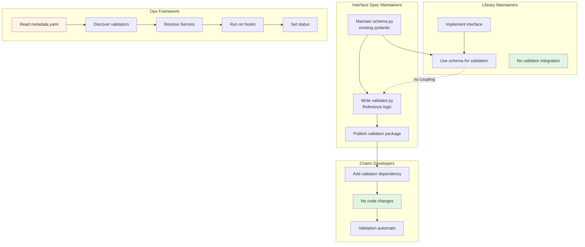
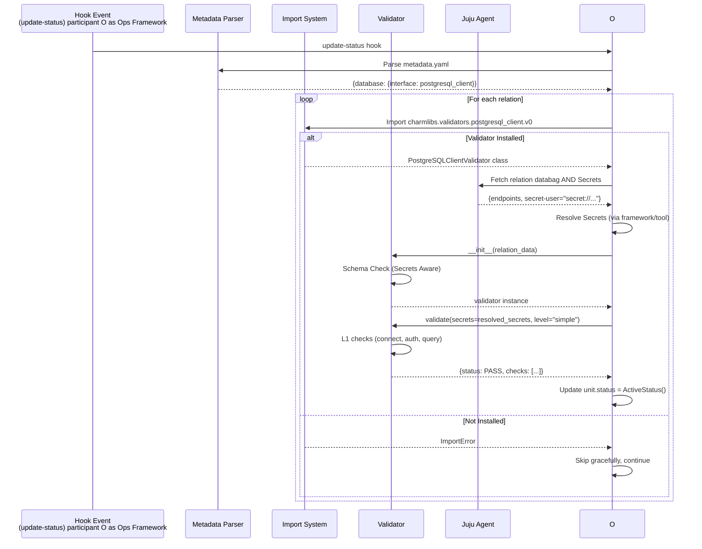
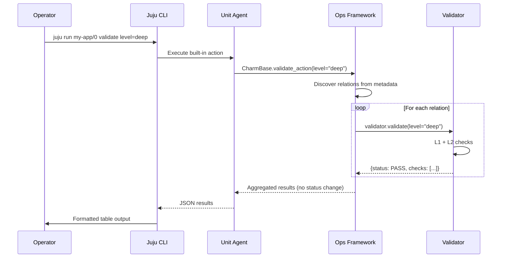
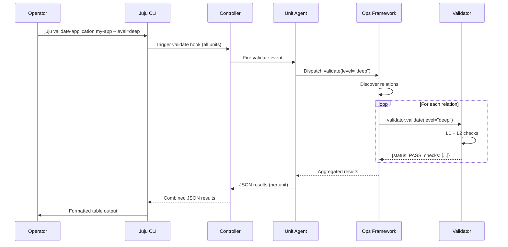

# SQ096: Interface Validators Framework (v4)

| Index | SQ096 |  |  |
| :---- | :---- | :---- | :---- |
| **Title** | **Interface Validators Framework** | | |
| **Type** | **Author(s)** | **Status** | **Created** |
| Architecture / Implementation | Ryan Barry, Claude Sonnet 4.5 | **Draft** | 20 Feb 2026 |
| | **Reviewer(s)** | **Status** | **Date** |
| | Charm Tech Team | Pending | |

---

## 1. Abstract

This specification proposes a mechanism for the Ops Framework to automatically discover and validate Juju relation interfaces. By standardizing validation logic into shared packages (`charmlibs-validators`), we enable the Charm Tech ecosystem to verify interface compliance consistently across all charms, without requiring changes to individual charm codebases. This approach treats interface validation as a distinct, framework-level concern, ensuring that complex integrations (like `postgresql_client`) function correctly regardless of the underlying library or charm framework version.

### 1.1 Key Innovation: The Reference Consumer

**This specification treats validation as a "Reference Implementation" problem.**

Instead of relying on the charm's own library to self-report health, the Framework spins up an independent, lightweight "Consumer" for the interface. This consumer performs the same connection rituals (handshakes, authentication, queries) as a real application ensuring the interface is functional.

**Why Framework-Driven?**

1.  **Independent Verification**: By decoupling validation from the charm's implementation library, we eliminate circular dependencies where a buggy library validates itself as "Healthy".
2.  **Universal Coverage**: Validation applies to *any* charm implementing the interface, regardless of whether it uses `data_platform_libs`, legacy hooks, or raw Juju calls.
3.  **Zero Boilerplate**: Charm authors inherit this validation capability simply by declaring the interface in `metadata.yaml`.

### 1.2 Package Architecture

Validators build on **existing interface schemas** but are distributed as separate Python packages. They act as "Test Consumers".

**Validator Package (This Specification):**
```
charmlibs-validators-postgresql-client
├── depends on: charmlibs-validators-base
├── depends on: psycopg2-binary (driver)
└── charmlibs/validators/postgresql_client/v0/
    └── validator.py  # Reference implementation consumer
```

### 1.3 Developer Experience: Who Does What?



---

## 2. Rationale & Problem Statement

### 2.1 The Challenge: Validating the Interface, Not the Library

A valid Juju interface is defined by the data on the wire, not the Python library used to put it there. To truly validate an integration, we must verify that the *external contract* is being met, independent of the internal implementation details.

**The Insight:**
To validate an interface, we are effectively building a **reference consumer implementation**. This "Validator" connects to the provider just like a real application (e.g., WordPress) would, but instead of serving traffic, it runs test assertions.

**Why this matters:**
*   **Decoupling:** If we relied on the charm's own library to validate the connection, we would be testing the library with itself. A bug in the library could mask a broken interface.
*   **Universality:** By implementing a standalone "Validation Consumer," we can validate *any* charm—whether it uses `data_platform_libs`, `reactive`, or raw Juju calls—because we interact only with the standard relation data.

### 2.2 Scope: Functional Verification

The goal is to prove **Functional Interoperability**.
A static schema check says "The data looks like a database credential."
A functional validator says "I can use these credentials to create a table and write a record."

This distinction is critical for Day 2 operations. An operator needs to know if the database is *usable*, not just if the Juju relation is syntactically correct.

### 2.3 Mechanism: Framework-Driven Discovery

**Design:** The Ops framework discovers validators **by convention** based on interface declarations in `metadata.yaml`.

**Validation Flow:**



---

## 3. Specification

### 3.1 Package Structure

#### 3.1.1 Validator Base Package

**Package Name:** `charmlibs-validators-base`
**Import Path:** `from charmlibs.validators.base import BaseValidator`

**Purpose:** Provides base class and type definitions. Crucially, it defines the contract for handling **Secrets**.

#### 3.1.2 Validator Package

**Package Name:** `charmlibs-validators-postgresql-client`
**Dependencies:** `psycopg2-binary` (Driver needed for L1/L2 checks)

**Contents:**
```python
# charmlibs/validators/postgresql_client/v0/validator.py
from charmlibs.validators.base import BaseValidator
import psycopg2

class PostgreSQLClientValidator(BaseValidator):
    interface_name = "postgresql_client"
    
    def validate(self, relation_data, secrets=None, level="simple"):
        # Logic matches "Living Spec" (Secret-aware)
        pass
```

### 3.2 Validator API

#### 3.2.1 Base Validator Class

The API must accept resolved secrets, as the Validator running inside the charm context might need framework assistance (or the Injector tool's assistance) to fetch them.

```python
from typing import TypedDict, Literal, Optional, List

class ValidationCheck(TypedDict):
    """Single validation check result."""
    name: str
    status: Literal["PASS", "FAIL", "ERROR"]
    message: str
    duration_ms: Optional[int]
    error: Optional[str]

class ValidationResult(TypedDict):
    """Complete validation result."""
    status: Literal["PASS", "FAIL", "ERROR"]
    interface: str
    level: str
    checks: List[ValidationCheck]
    error: Optional[dict]

class BaseValidator(ABC):
    """The contract for all interface validators."""
    
    interface_name: str
    
    def __init__(self, context: dict):
        self.context = context

    @abstractmethod
    def validate(self, relation_data: dict, secrets: dict = None, level: str = "simple") -> ValidationResult:
        """
        Run validation checks.
        
        Args:
            relation_data: The raw databag content.
            secrets: A dictionary mapping Juju Secret URIs to their resolved content.
                     The framework/runner is responsible for resolving these before calling.
            level: "simple" (L1) or "deep" (L2).
        """
        pass
```

#### 3.2.2 Validation Levels

| Level | Goal | Execution Limit | Actions |
| :--- | :--- | :--- | :--- |
| **L1 (Simple)** | **Connectivity & Auth** | < 5s | • **Schema Check**: Validates wire format (allowing Secrets).<br>• **Connectivity**: TCP connect to endpoint.<br>• **Auth**: Authenticate using credentials (from Secret).<br>• **Query**: `SELECT 1` |
| **L2 (Deep)** | **Functional I/O** | < 60s | • **Canary**: Create table/topic.<br>• **Traffic**: Write/Read record.<br>• **Cleanup**: Remove canary. |

### 3.3 Framework Integration

#### 3.3.1 Discovery Pattern
The framework uses "Convention over Configuration":
1.  Read `metadata.yaml` -> `requires: database` -> `interface: postgresql_client`.
2.  Attempt import: `charmlibs.validators.postgresql_client`.
3.  If successful, instantiate and run.

#### 3.3.2 Validation Modes

1.  **Automatic Validation (Background)**
    - Trigger: `update-status`
    - Level: `simple`
    - Action: Sets `UnitStatus` (Blocked if FAIL).

2.  **On-Demand Validation (Operator)**
    - Trigger: Juju Action or Hook.
    - Level: User defined (`deep`).
    - Action: Returns JSON report.

**On-Demand Validation Flow (Option A: Action):**



**On-Demand Validation Flow (Option B: Hook):**



---

## 4. Implementation Plan

### 4.1 Development Approach: The "Injector" Bridge
We define a concrete **Phase 1** using an "Injector Tool" to bridge the gap before the Ops framework is updated. This allows us to validate the **Runtime Verification Model** immediately.

### 4.2 Phase 1: The "Injector" POC (Current State)
Since properly resolving Juju Secrets inside a running unit from an external test suite is complex, the **Validator Injector** pattern is used.

**Mechanism:**
1.  **Test Runner** detects target unit.
2.  **Injector** bundles the Validator Code + Dependencies (wheels) and `scp`s them to the unit.
3.  **Injector** runs `juju exec ... python3 validator_entrypoint.py`.
4.  **Entrypoint**:
    - Accesses `hook-tool` (like `secret-get`) or uses the unit's python environment to resolve secrets.
    - Runs the Validator logic locally.
    - Prints JSON result to stdout.

This mimics the future Framework behavior (running inside the unit) without requiring immediate `ops` changes.

### 4.3 Phase 2: Framework Native (Target)

#### Framework Integration Options

Two valid approaches for on-demand validation. **Charm Tech team should decide which to pursue:**

**Option A: Ops-Provided Action (Simpler)**

**Changes Required:**
- **Ops Framework:** Add `_auto_validate_integrations()` and built-in `validate` action.
- **Benefits:** No Juju Core changes required. Immediate availability.
- **Drawbacks:** Per-unit execution (user must target specific units).

**Option B: Dedicated Validate Hook (More Powerful)**

**Changes Required:**
- **Juju Core:** Add `validate` hook and `juju validate-application` CLI command.
- **Ops Framework:** Handle new `validate` event.
- **Benefits:** Application-level validation (aggregates all units). Structured output built-in.
- **Drawbacks:** Major Juju Core changes needed.

**Recommendation:** Start with **Option A** (action) for faster delivery.

### 4.4 Tooling Integration

**Charmcraft Lint:**
- Warn if `pyproject.toml` is missing the validator package for a declared interface.

**Charmcraft Pack:**
- Suggest adding validators during packing.

---

## 5. Risks & Mitigations

### 5.1 Dependency Conflicts
**Risk:** Validators need drivers (`psycopg2`) which might conflict with charm dependencies.
**Mitigation:** Phase 1 (Injector) isolates execution in a separate process/venvs. Phase 2 leverages standard pip resolution, or we vendor tightly scoped drivers.

### 5.2 Definition of "Correctness"
**Risk:** Disagreement between `schema.py` (structure) and `validator.py` (behavior).
**Mitigation:** We explicitly separate their concerns. `schema.py` defines the **Data Structure** (types, keys). `validator.py` defines the **Behavioral Contract** (can I log in?). The Validator is the authoritative source for operational health.

### 5.3 Performance
**Risk:** Running `update-status` validation too frequently connects to DBs unnecessarily.
**Mitigation:** Only run if status is not already "Blocked", or implement rate-limiting in the framework (min 5 min interval).

---

## 6. Acceptance Criteria

1.  **Functional Verification**: Validator MUST assert health by performing actual protocol operations (e.g., SQL query), verifying the end-to-end integration works.
2.  **Runtime Resolution**: Validator MUST be able to resolve and use runtime artifacts (like Juju Secrets) that are not visible to static analysis.
3.  **Implementation Agnostic**: Validator MUST work with `data_platform_libs`, `reactive`, and `bare` charms equally.
4.  **Injector Parity**: The Phase 1 injector tool produces the same JSON output format as the Phase 2 framework integration will.
5.  **Zero Code**: A charm author adds the dependency, and validation happens automatically.
6.  **Dual Mode Support**: Supports both Automatic (runs on status) and On-Demand (runs via action) modes.

---

## 7. Open Questions

1.  **Secrets in Phase 2**: How exactly does the Ops framework pass resolved secrets to the validator? Does it pass the `Secret` object or the dictionary?
    *   *Proposed Answer*: Passes the `Secret` wrapper; Validator calls `.get_content()` which triggers the hook tool.
2.  **Status Management**: If validation fails, do we overwrite the existing status completely?
    *   *Proposed Answer*: Yes, if status is Active/Idle. If already Blocked/Maintenance, we append.
3.  **Implementation Option**: Option A vs Option B?
    *   *Answer*: Proceed with Option A (Action) for immediate testing.

---

## 8. Next Steps

1.  **Refine the POC**: Finish the `ValidatorInjector` to fully automate the Phase 1 flow described above.
2.  **Publish Base Specs**: Finalize `charmlibs-validators-base` and publish to PyPI.
3.  **Build Phase 2 Prototype**: Fork `ops` locally to demonstrate the "Auto-Discovery" mechanism.
