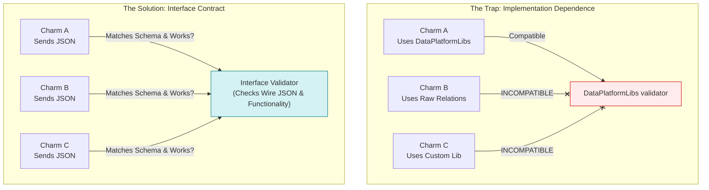
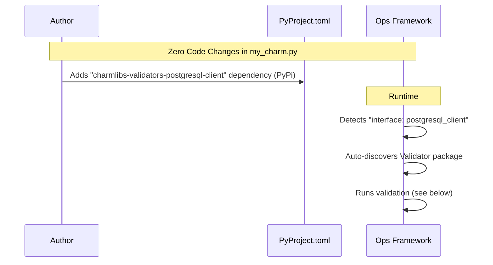
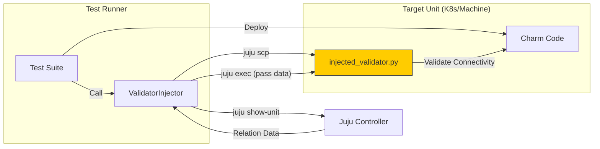
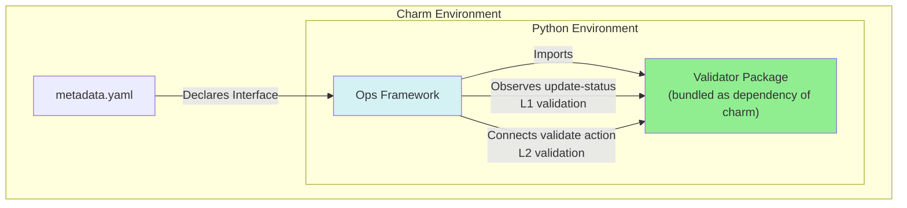

# SQ096: Interface Validators Framework (v4)

| Index | SQ096 |  |  |
| :---- | :---- | :---- | :---- |
| **Title** | **Interface Validators Framework** | | |
| **Type** | **Author(s)** | **Status** | **Created** |
| Architecture / Implementation | Ryan Barry, Claude Sonnet 4.5 | **Draft** | 20 Feb 2026 |
| | **Reviewer(s)** | **Status** | **Date** |
| | Charm Tech Team | Pending | |

---

# Abstract

This specification proposes **Framework-Driven Interface Validation**, a mechanism for the Ops Framework to automatically discover and execute integration health checks. By standardizing "Interface Validators" as independent Python packages, we decouple validation logic from charm implementation details. This ensures that any charm claiming to support an interface (e.g., `postgresql_client`) can be objectively verified for protocol compliance and functional connectivity, regardless of whether it uses `data_platform_libs`, legacy hooks, or raw Juju calls. The result is a rigorous "Day 2" operational assurance system that transforms Juju Status from a simple execution signal into a reliable indicator of service health.

# Rationale

### The "Active != Operational" Gap
Juju's `active/idle` status currently signals *execution success*, not *service health*. It indicates that charm hooks ran without crashing, but purely internal checks cannot guarantee that the workload is functioning or that cross-application integrations are viable.

**Real-World Failures:**
*   **Authentication Mismatch:** A database charm is "Active", but the client application silently fails to reconnect because credentials rotated and the client didn't update.
*   **Network Partition:** A frontend is "Active", but firewall rules block access to its backend.
*   **Zombie Services:** `systemd` reports the service is running, but the internal application server is hung or unresponsive to requests.
*   **Permissions:** A storage integration is "Active", but the application cannot write files due to misconfigured ACLs.

**The Impact:**
*   **Operational Blindspots:** SREs cannot trust "Green" dashboards.
*   **High Triage Cost:** Engineers waste cycles debugging "Active" units, manually tracing logs to find basic connectivity issues.
*   **Fragile Upgrades:** Without a systematic way to verify data continuity (e.g., "Can I still read the data I wrote before the upgrade?"), updates are risky.

### Limitations of Existing Approaches

**1. Manual Testing:**
*   Requires `juju ssh` access and domain-specific knowledge of client tools (e.g., `psql`, `mongosh`).
*   Results are not captured in CI/CD or audit logs.
*   Knowledge is siloed in individual runbooks, leading to inconsistent validation.

**2. External Integration Tests:**
*   Test logic lives in separate repositories, decoupled from the charm revision.
*   Difficult or dangerous to run against production models (requires external access keys).
*   No standard interface; every test suite is custom-built.

**3. Kubernetes Probes:**
*   **Process vs. Logic:** Only validate that a socket is open, not that the application is functional.
*   **Scope:** Cannot validate **cross-charm integrations** (e.g., "Can I query the DB I'm related to?").
*   **Platform Specific:** No equivalent standard mechanism exists for Machine charms.

### The Solution: Interface Validators
To bridge this gap, we need **Functional Interface Validation**. We cannot rely on the charm's own library to report health, as it may be the source of the bug. Instead, we need an objective "Reference Consumer" that:
1.  **Validates the Protocol:** Checks that the relation data (including Secrets) is valid.
2.  **Verifies Connectivity:** Proves that a client can actually connect and authenticate.
3.  **Asserts Functionality:** Performs real operations (write/read) to prove the integration is effectively usable.

# Specification

## User Stories

### US-1: The Charm Developer (Zero Config)
**As a** Charm Developer,
**I want** to enable interface validation simply by adding a Python dependency,
**So that** I don't have to write, maintain, or debug custom connection logic for every interface my charm supports.

### US-2: The QA Engineer (Data Integrity Gates)
**As a** QA Engineer,
**I want** CI pipelines to automatically verify data persistence during upgrades,
**So that** I can block releases that technically "succeed" but silently corrupt or lose data (e.g., ensuring `SELECT count(*)` matches before and after a charm upgrade).

### US-3: The SRE (Incident Response)
**As an** SRE/Operator,
**I want** to manually trigger a deep validation check via a simple Juju Action (e.g., `juju run my-app/0 validate`),
**So that** I can definitively isolate whether an outage is caused by the application, the network, or the database, without needing to SSH into units or install custom client tools.

### US-4: The SRE (Proactive Monitoring)
**As an** SRE,
**I want** Juju to periodically validate integration health in the background and reflect it in the unit status,
**So that** my dashboards turn red immediately when a connection fails, rather than waiting for user reports or downstream timeouts.

## 1. What we are actually testing

A critical distinction discovered during the POC is that we are building **Interface Validators**, not **Library Testers**.

### The Scope: Interface Contracts

*   **We do NOT validate Libraries:** Interfaces can be fulfilled by diverse methods:
    *   `postgresql-k8s-operator`: Uses its own library implementation.
    *   `data-platform-libs`: A generic library handling multiple interfaces.
    *   `bare-charm-code`: A charm accessing `self.model.relations` directly.



**Key Insight:** To validate an interface, we are effectively *building a new library compliant with the spec*, but instead of *app logic*, it performs *validation logic*.

If we coupled validation to specific libraries (e.g., `data_interfaces.py`), we would need different validators **for every library**.

### The Depth: Validation Levels

| Level | Goal | Actions | Target |
| :--- | :--- | :--- | :--- |
| **L1 (Simple)** | **Connectivity & Auth** | • Check Schema Compliance<br>• Authentication Handshake<br>• Read-only query (e.g. `SELECT 1`) | < 5s |
| **L2 (Deep)** | **Read/Write Capability** | • Create Canary Table<br>• Write Record<br>• Read & Verify<br>• Cleanup | < 60s |
| **L3 (UAT)** | **End-to-End** | • Full Application Logic<br>• (Future Scope) | > 1m |

### Key Findings on Existing Tooling

1.  **There is a tool called `pytest-interface-tester`.**
    *   It is designed to check if *authors of libraries* are compliant with the interface spec.
    *   It is a CI tool, not a runtime operational tool.
    *   `charmlibs` has a dependence on it, but not the other way around for some reason I can not ascertain.
    *   Our goal is **Runtime/Day-2 Validation** for Operators.

2.  **The Shift to PyPI / `charmlibs`.**
    *   Charmhub-hosted libraries are becoming legacy.
    *   The future is `charmlibs` on PyPI (e.g., `charmlibs-interfaces-tls-certificates`).
    *   *Decision:* We should build validators as **PyPI packages** that depend on these existing interface schemas.

3.  **Juju Doctor.**
    *   Focuses on **Topological Validation** (Outside-In): "Is HA enabled? Are 3 units deployed?"
    *   We focus on **Functional Connectivity** (Inside-Out): "Can I actually write to the DB?"
    *   They are complementary: Doctor validates the *setup*; Validators validate the *service*.

## 2. The Vision: "Built-in" Validation

We want the Developer Experience (DX) to be invisible. It would be neat if the charm author did not have to write a single line of validation code.

### The Charm Author's View

The charm author should simply add a dependency on the validators package for their interfaces, such as `charmlibs-validators-postgresql-client`.



### Discovery & Warnings

We could drive adoption with warnings similar to the existing charm libs warnings. Or perhaps something like this:

```bash
$ charmcraft pack
[W] missing-validator: interface 'postgresql_client' declared but validator not found.
    Add 'charmlibs-validators-postgresql-client' to pyproject.toml to enable health checks.
```

### The Validator Development and Maintenance

Validators are maintained by interface schema maintainers in `charmlibs`.

To ensure interoperability, all validator packages must adhere to a standard interface, likely distributed as `charmlibs-validators-base`.

```python
from abc import ABC, abstractmethod
from typing import TypedDict, Literal, Optional, List

# Standardized Result Format
class ValidationResult(TypedDict):
    status: Literal["PASS", "FAIL", "ERROR"]
    interface: str
    level: str
    checks: List[ValidationCheck]
    error: Optional[ValidationError]

class BaseValidator(ABC):
    """The contract for all interface validators."""
    
    interface_name: str = ""  # Must be defined by subclass

    @abstractmethod
    def validate(self, relation_data: dict, level: str = "simple") -> ValidationResult:
        """Run validation checks against the relation data."""
        pass
```

## 3. Implementation Strategy

To get there, we are bridging the gap between a "Hacked" POC and the Final Architecture.

### Phase 1: The "Injector" POC (Current State)

Since we cannot modify `ops` or `juju` yet, the POC achieves validation by **injecting** the validator logic into the target container effectively "emulating" the framework support.

*   **Mechanism:** `ValidatorInjector` extension.
*   **Action:** Copies validator code into the charm container at integration test time.
*   **Trigger:** Manually invoked by `JujuClient`.
*   **Dependency Management (Restricted Networks):**
    *   Since the validator runs inside the workload container, dependencies (like `psycopg2`) must be present.
    *   *Challenge:* In restricted environments, we cannot `pip install` from PyPI.
    *   *Workaround:* We open up the proxy, or the test runner downloads wheels on the host and copies them to the unit alongside the validator code.



### Phase 2: The Target Architecture (SQ096)

We move from injection to **import**. Validators are standard Python libraries.

*   **Mechanism:** Bundled in the charm, called by the `ops` framework extension or update.
*   **Distribution:** PyPI (`charmlibs-validators-*`).
*   **Base Contract:** `charmlibs-validators-base` (defines `BaseValidator`).
*   **Trigger:** Native Juju Hooks (`update-status`) and/or Actions.



## 4. Suggested Changes to Ops Framework

We are flexible here, and there are some unknowns. From our perspective, implementing these changes into the ops framework would ensure consistency and minimal changes for charm maintainers, driving adoption.

### Framework Integration

**1. Automatic Validation Loop (Optional)**
*   Add `_auto_validate_integrations()` method to `CharmBase`.
*   *(Suggested)* Automatically subscribe to the `update-status` hook.
*   On each tick, discover interfaces from `metadata.yaml`, instantiate found validators, and run L1 checks.
    *   *Consider better ways to do this:* How can the ops framework know a validator is available, with as little work from charm maintainers as possible?
*   **Context:** While continuous validation is valuable, the primary driver is enabling QA/Tests to invoke these checks without maintaining external test suites.

**2. Discovery Logic**
*   Implement a "Convention over Configuration" discovery mechanism.
*   If `requires: postgresql_client` exists -> try import `charmlibs.validators.postgresql_client`.
*   **Graceful Degradation:** If the package is not installed, do nothing (no crash).

**3. On-Demand Action**
*   Add a built-in `validate` action to `CharmBase`.
*   Allows operators to trigger L2 (Deep) validation manually:
    *   `juju run my-app/0 validate level=deep`

```python
# Pseudo-code for Ops implementation
class CharmBase:
    def __init__(self, framework):
        # ... existing init ...
        
        # New: Auto-wire validation
        self.framework.observe(self.on.update_status, self._auto_validate_integrations)
        self.framework.observe(self.on.validate_action, self._on_validate_action)

    def _auto_validate_integrations(self, event):
        for relation_name, interface in self.meta.requires.items():
            validator = self._get_validator_for(interface)
            if validator:
                result = validator.validate(level="simple")
                self.unit.status = self._status_from_result(result)
```

## Risk Mitigation

#### Adoption Risk
**Risk:** Charm developers do not add the validator dependency, leading to coverage gaps.
**Mitigation:**
*   **Zero-Code Effort:** Developers only need to add a line to `pyproject.toml`.
*   **Tooling Nudges:** `charmcraft pack` warns if an interface is declared but no validator is present.
*   **Immediate Value:** CI/CD pipelines can use the "Injector" (Phase 1) to validate charms even if they haven't adopted the library yet, proving the value before asking for changes.

#### Production Data Corruption
**Risk:** "Deep" (L2) validation writes test data that interferes with production applications.
**Mitigation:**
*   **Strict Levels:** L1 (Default) is strictly **Read-Only / Connectivity**.
*   **Explicit Opt-In:** L2 (Write) checks only run when explicitly triggered by an operator action (`juju run ... level=deep`).
*   **Namespacing:** Validators use distinct artifacts (e.g., SQL tables named `_juju_validation_canary`) to avoid collisions.
*   **Cleanup:** Validators implement `try/finally` blocks to ensure canary data is removed.

#### Operational Noise (False Positives)
**Risk:** Transient network blips cause units to flip to "Blocked", waking up SREs unnecessarily.
**Mitigation:**
*   **Graceful Degradation:** The Ops framework implements a "buffer": 1 failure = Warning log; 3 consecutive failures = Status change.
*   **Passive Mode:** Validators can be configured to log-only without affecting unit status.
*   **Timeout Budgets:** Strict timeouts (e.g., 5s for L1) prevent validation hangs from stalling the charm hook loop.

#### Performance Impact
**Risk:** Creating connections or running queries during every `update-status` hook loads the database.
**Mitigation:**
*   **Cadence Control:** Validation only runs on `update-status` (default 5m interval), not every hook.
*   **Smart Backoff:** If the unit is already in a known error state, validation pauses to prevent log spam.
*   **Connection Reuse:** Where possible, validators reuse existing connection pools or drivers.

#### Dependency Conflicts
**Risk:** The validator package requires a specific driver version (e.g., `psycopg2`) that conflicts with the charm's own dependencies.
**Mitigation:**
*   **Phase 1 (Injector):** Runs in a separate process or virtual environment, completely isolated range.
*   **Phase 2 (Native):** Validators should rely on standard interfaces or `extras` (e.g., `pip install charmlibs-validators-postgresql[psycopg2]`) to allow charms to align versions.
*   **Fallback:** If dependencies cannot be satisfied, the framework gracefully skips validation rather than crashing the charm.

# Further Information