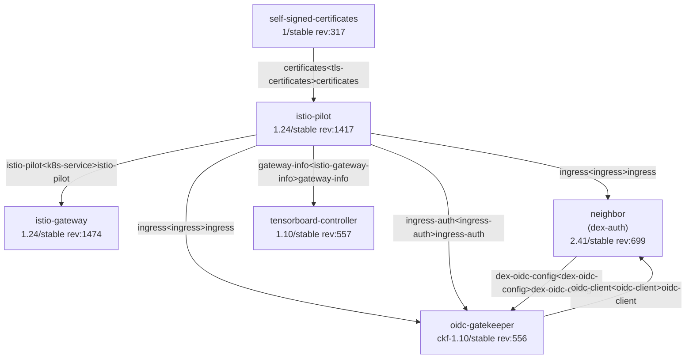

```mermaid
graph TB
    istio-gateway["istio-gateway<br/>1.24/stable rev:1474"]
    istio-pilot["istio-pilot<br/>1.24/stable rev:1417"]
    neighbor["neighbor<br/>(dex-auth)<br/>2.41/stable rev:699"]
    oidc-gatekeeper["oidc-gatekeeper<br/>ckf-1.10/stable rev:556"]
    self-signed-certificates["self-signed-certificates<br/>1/stable rev:317"]
    tensorboard-controller["tensorboard-controller<br/>1.10/stable rev:557"]

    istio-pilot -->|istio-pilot&lt;k8s-service&gt;istio-pilot| istio-gateway
    self-signed-certificates -->|certificates&lt;tls-certificates&gt;certificates| istio-pilot
    istio-pilot -->|gateway-info&lt;istio-gateway-info&gt;gateway-info| tensorboard-controller
    istio-pilot -->|ingress&lt;ingress&gt;ingress| neighbor
    istio-pilot -->|ingress&lt;ingress&gt;ingress| oidc-gatekeeper
    istio-pilot -->|ingress-auth&lt;ingress-auth&gt;ingress-auth| oidc-gatekeeper
    neighbor -->|dex-oidc-config&lt;dex-oidc-config&gt;dex-oidc-config| oidc-gatekeeper
    oidc-gatekeeper -->|oidc-client&lt;oidc-client&gt;oidc-client| neighbor
```
