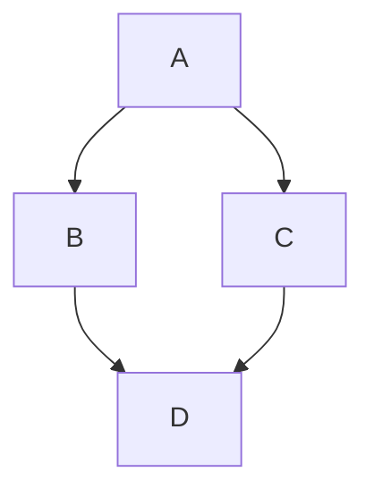

# Overview

A utility for resolving minimally-deployable bundles for sets of charms using their required integrations.

## Getting Started

See [../README.md](../README.md) for repository setup and development information.

## Usage

```bash
../scripts/build-bundle.sh --help
```

## The Bundle Building Algorithm

### Goal

The bundle resolution algorithm solves a tree traversal problem for which additional charms are added to the bundle set in order to resolve charm integration endpoints marked as non-optional by the charm's metadata.

### Inputs and outputs

The bundle building algorithm accepts a base bundle of charms and integrations specified by the user, and the product is a bundle with additional applications that fulfill as many non-optional endpoints as possible.

### Tree Traversal: Uniform Cost Search

Uniform Cost Search is used to find the least-cost path from a starting node to a goal node in a weighted graph. It is basically Dijkstra's algorithm but is defined to search for a single node goal on an undiscovered graph.

The algorithm implementation is in [bundle_builder/bundle_builder.py](bundle_builder/bundle_builder.py).

### How the graph is defined

Each edge in our graph is defined as the addition of a charm to a base bundle. Each node therefore represents an unordered set of charms bundle.


