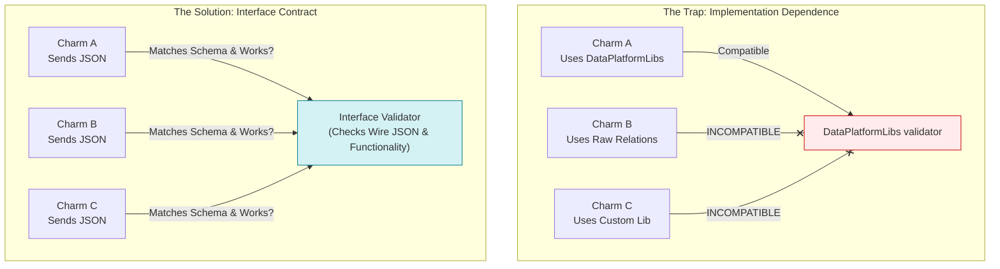
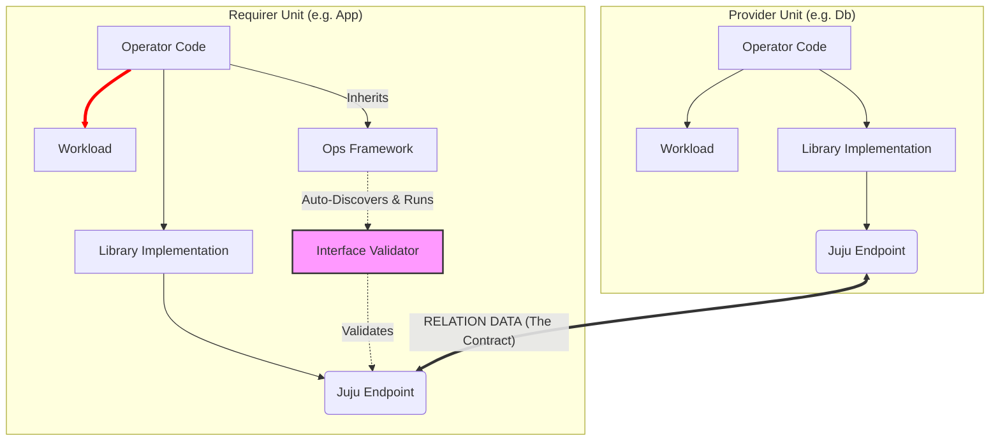
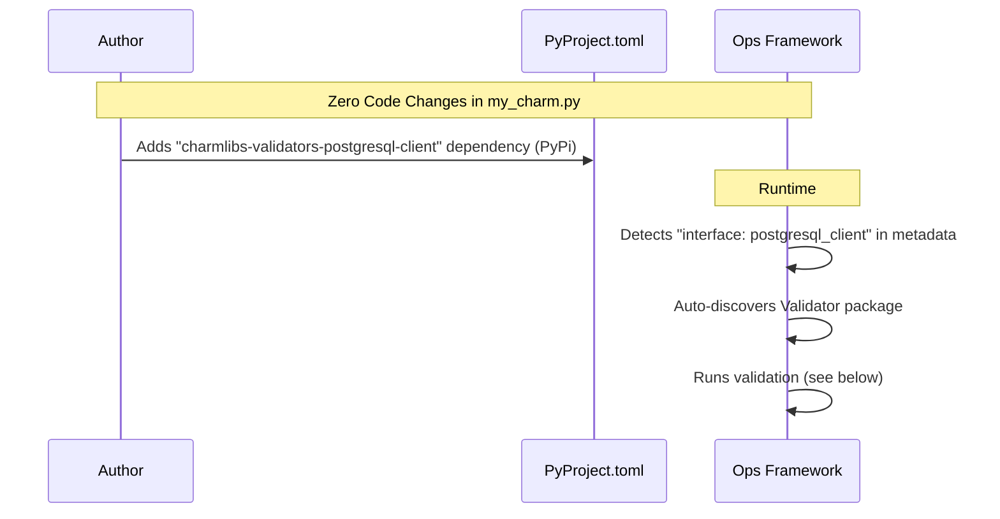
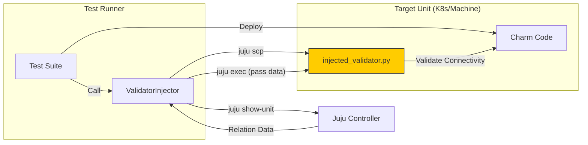
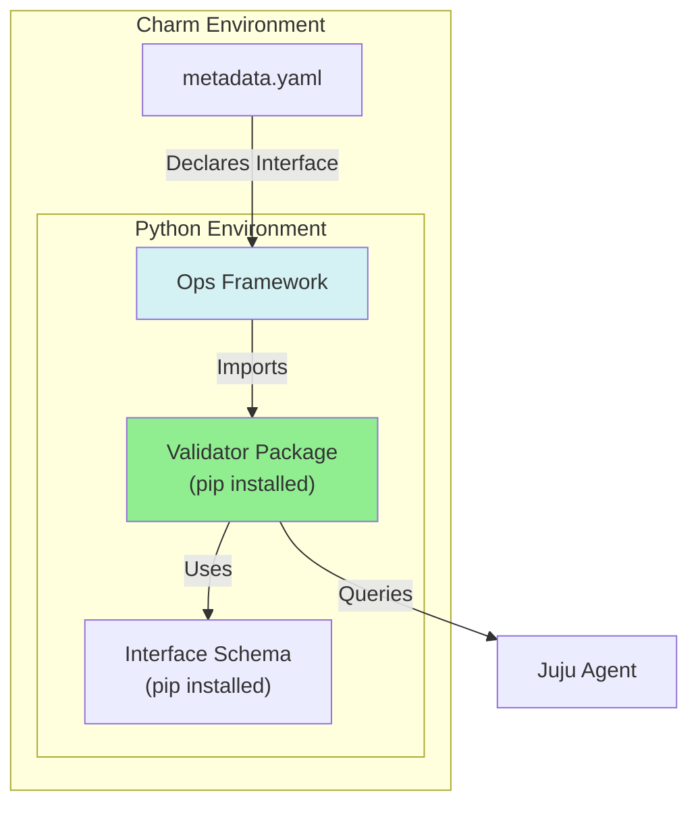

# POC Discoveries & Path Forward: Interface Validators

This document outlines the key findings from the `endpoint-probe` POC and details why the **Framework-Driven Validation** approach (SQ096) is the optimal path forward for the ecosystem.

## 1. What Are We Actually Testing?

A critical distinction discovered during the POC is that we are building **Interface Validators**, not **Library Testers**.

### The Scope: Interface Contracts

*   **We do NOT validate Libraries:** Interfaces can be fulfilled by diverse methods:
    *   `postgresql-k8s-operator`: Uses its own library implementation.
    *   `data-platform-libs`: A generic library handling multiple interfaces.
    *   `bare-charm-code`: A charm accessing `self.model.relations` directly.



*   **We validate the Interface Contract:** Does the relation data on the wire match the schema? specific to the `interface` type (e.g., `postgresql_client`).



**Key Insight:** To validate an interface, we are effectively *building a new library compliant with the spec*, but instead of *app logic*, it performs *validation logic*.

If we coupled validation to specific libraries (e.g., `data_interfaces.py`), we would need different validators **for every library**.

### The Depth: Validation Levels

| Level | Goal | Actions | Target |
| :--- | :--- | :--- | :--- |
| **L1 (Simple)** | **Connectivity & Auth** | • Check Schema Compliance<br>• Authentication Handshake<br>• Read-only query (e.g. `SELECT 1`) | < 5s |
| **L2 (Deep)** | **Read/Write Capability** | • Create Canary Table<br>• Write Record<br>• Read & Verify<br>• Cleanup | < 60s |
| **L3 (UAT)** | **End-to-End** | • Full Application Logic<br>• (Future Scope) | > 1m |

### Key Findings on Existing Tooling

1.  **There is a tool called `pytest-interface-tester`.**
    *   It is designed to check if *authors of libraries* are compliant with the interface spec.
    *   It is a CI tool, not a runtime operational tool.
    *   `charmlibs` has a dependence on it, but not the other way around for some reason I can not ascertain.
    *   Our goal is **Runtime/Day-2 Validation** for Operators.

2.  **The Shift to PyPI / `charmlibs`.**
    *   Charmhub-hosted libraries are becoming legacy.
    *   The future is `charmlibs` on PyPI (e.g., `charmlibs-interfaces-tls-certificates`).
    *   *Decision:* We should build validators as **PyPI packages** that depend on these existing interface schemas.
3.  **Juju Doctor.**
    *   Focuses on **Topological Validation** (Outside-In): "Is HA enabled? Are 3 units deployed?"
    *   We focus on **Functional Connectivity** (Inside-Out): "Can I actually write to the DB?"
    *   They are complementary: Doctor validates the *setup*; Validators validate the *service*.

## 2. The Vision: "Built-in" Validation

We want the Developer Experience (DX) to be invisible. The charm author should not have to write a single line of validation code.

### The Charm Author's View



### Discovery & Warnings

We could drive adoption with warnings similar to the existing charm libs warnings. Or perhaps:

```bash
$ charmcraft pack
[W] missing-validator: interface 'postgresql_client' declared but validator not found.
    Add 'charmlibs-validators-postgresql-client' to pyproject.toml to enable health checks.
```

## 3. Implementation Strategy

To get there, we are bridging the gap between a "Hacked" POC and the Final Architecture.

### Phase 1: The "Injector" POC (Current State)

Since we cannot modify `ops` or `juju` yet, the POC achieves validation by **injecting** the validator logic into the target container effectively "emulating" the framework support.

*   **Mechanism:** `ValidatorInjector` extension.
*   **Action:** Copies validator code into the charm container at integration test time.
*   **Trigger:** Manually invoked by `JujuClient`.
*   **Dependency Management (Restricted Networks):**
    *   Since the validator runs inside the workload container, dependencies (like `psycopg2`) must be present.
    *   *Challenge:* In restricted environments, we cannot `pip install` from PyPI.
    *   *Workaround:* We open up the proxy, or the test runner downloads wheels on the host and copies them to the unit alongside the validator code.



### Phase 2: The Target Architecture (SQ096)

We move from injection to **import**. Validators are standard Python libraries.

*   **Mechanism:** `ops` framework extension or update.
*   **Distribution:** PyPI (`charmlibs-validators-*`).
*   **Base Contract:** `charmlibs-validators-base` (defines `BaseValidator`).
*   **Trigger:** Native Juju Hooks (`update-status`) and/or Actions.

### The Validator Contract (`BaseValidator`)

To ensure interoperability, all validator packages must adhere to a standard interface, likely distributed as `charmlibs-validators-base`.

```python
from abc import ABC, abstractmethod
from typing import TypedDict, Literal, Optional, List

# Standardized Result Format
class ValidationResult(TypedDict):
    status: Literal["PASS", "FAIL", "ERROR"]
    interface: str
    level: str
    checks: List[ValidationCheck]
    error: Optional[ValidationError]

class BaseValidator(ABC):
    """The contract for all interface validators."""
    
    interface_name: str = ""  # Must be defined by subclass

    @abstractmethod
    def validate(self, relation_data: dict, level: str = "simple") -> ValidationResult:
        """Run validation checks against the relation data."""
        pass
```



## 4. Suggested Changes to Ops Framework

To make Phase 2 a reality, we need to introduce "Framework-Driven Validation" into `ops`.

### Framework Integration

**1. Automatic Validation Loop (Optional)**
*   Add `_auto_validate_integrations()` method to `CharmBase`.
*   *(Suggested)* Automatically subscribe to the `update-status` hook.
*   On each tick, discover interfaces from `metadata.yaml`, instantiate found validators, and run L1 checks.
    *   *Consider better ways to do this:* How can the ops framework know a validator is available, with as little work from charm maintainers as possible?
*   **Context:** While continuous validation is valuable, the primary driver is enabling QA/Tests to invoke these checks without maintaining external test suites.

**2. Discovery Logic**
*   Implement a "Convention over Configuration" discovery mechanism.
*   If `requires: postgresql_client` exists -> try import `charmlibs.validators.postgresql_client`.
*   **Graceful Degradation:** If the package is not installed, do nothing (no crash).

**3. On-Demand Action**
*   Add a built-in `validate` action to `CharmBase`.
*   Allows operators to trigger L2 (Deep) validation manually:
    *   `juju run my-app/0 validate level=deep`

```python
# Pseudo-code for Ops implementation
class CharmBase:
    def __init__(self, framework):
        # ... existing init ...
        
        # New: Auto-wire validation
        self.framework.observe(self.on.update_status, self._auto_validate_integrations)
        self.framework.observe(self.on.validate_action, self._on_validate_action)

    def _auto_validate_integrations(self, event):
        for relation_name, interface in self.meta.requires.items():
            validator = self._get_validator_for(interface)
            if validator:
                result = validator.validate(level="simple")
                self.unit.status = self._status_from_result(result)
```

## 5. Next Steps (AI suggested...)

1.  **Refine the POC:** Finish the `ValidatorInjector` to fully automate the Phase 1 flow.
2.  **Publish Base Specs:** Finalize `SQ096` to get agreement on the `BaseValidator` API.
3.  **Build Phase 2 Prototype:** Fork `ops` locally to demonstrate the "Auto-Discovery" mechanism essentially creating the "Golden Demo".
