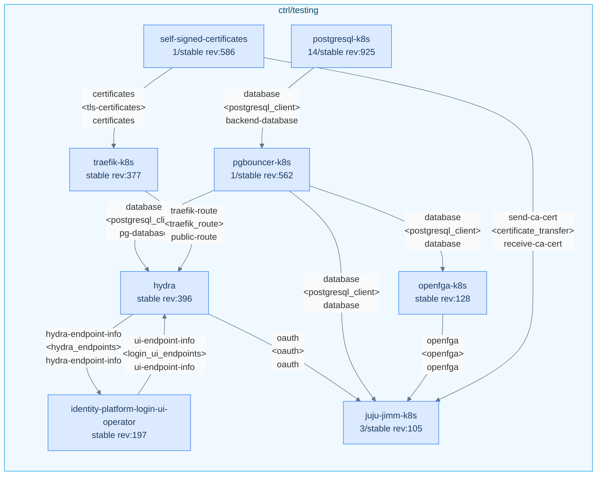

```mermaid
%%{init: {'theme': 'base', 'themeVariables': {'lineColor': '#64748b', 'edgeLabelBackground': '#f8fafc'}}}%%
graph TB
    classDef app fill:#dbeafe,stroke:#3b82f6,color:#1e3a5f

    subgraph ctrl/testing[ctrl/testing]
        direction TB
        ctrl/testing__hydra["hydra<br/>stable rev:396"]:::app
        ctrl/testing__identity-platform-login-ui-operator["identity-platform-login-ui-operator<br/>stable rev:197"]:::app
        ctrl/testing__juju-jimm-k8s["juju-jimm-k8s<br/>3/stable rev:105"]:::app
        ctrl/testing__openfga-k8s["openfga-k8s<br/>stable rev:128"]:::app
        ctrl/testing__pgbouncer-k8s["pgbouncer-k8s<br/>1/stable rev:562"]:::app
        ctrl/testing__postgresql-k8s["postgresql-k8s<br/>14/stable rev:925"]:::app
        ctrl/testing__self-signed-certificates["self-signed-certificates<br/>1/stable rev:586"]:::app
        ctrl/testing__traefik-k8s["traefik-k8s<br/>stable rev:377"]:::app

        ctrl/testing__hydra -->|"hydra-endpoint-info<br/>&lt;hydra_endpoints&gt;<br/>hydra-endpoint-info"| ctrl/testing__identity-platform-login-ui-operator
        ctrl/testing__hydra -->|"oauth<br/>&lt;oauth&gt;<br/>oauth"| ctrl/testing__juju-jimm-k8s
        ctrl/testing__pgbouncer-k8s -->|"database<br/>&lt;postgresql_client&gt;<br/>pg-database"| ctrl/testing__hydra
        ctrl/testing__traefik-k8s -->|"traefik-route<br/>&lt;traefik_route&gt;<br/>public-route"| ctrl/testing__hydra
        ctrl/testing__identity-platform-login-ui-operator -->|"ui-endpoint-info<br/>&lt;login_ui_endpoints&gt;<br/>ui-endpoint-info"| ctrl/testing__hydra
        ctrl/testing__pgbouncer-k8s -->|"database<br/>&lt;postgresql_client&gt;<br/>database"| ctrl/testing__juju-jimm-k8s
        ctrl/testing__openfga-k8s -->|"openfga<br/>&lt;openfga&gt;<br/>openfga"| ctrl/testing__juju-jimm-k8s
        ctrl/testing__self-signed-certificates -->|"send-ca-cert<br/>&lt;certificate_transfer&gt;<br/>receive-ca-cert"| ctrl/testing__juju-jimm-k8s
        ctrl/testing__pgbouncer-k8s -->|"database<br/>&lt;postgresql_client&gt;<br/>database"| ctrl/testing__openfga-k8s
        ctrl/testing__postgresql-k8s -->|"database<br/>&lt;postgresql_client&gt;<br/>backend-database"| ctrl/testing__pgbouncer-k8s
        ctrl/testing__self-signed-certificates -->|"certificates<br/>&lt;tls-certificates&gt;<br/>certificates"| ctrl/testing__traefik-k8s
    end
    style ctrl/testing fill:#f0f9ff,stroke:#0ea5e9,color:#0c4a6e

```
